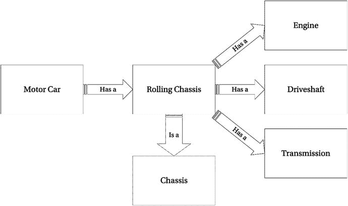
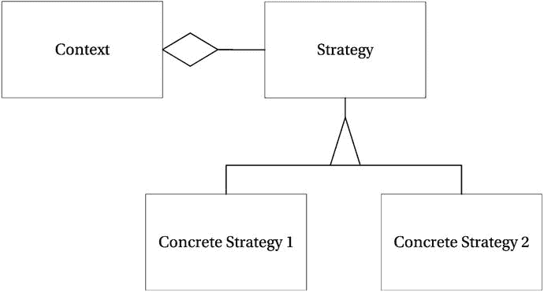
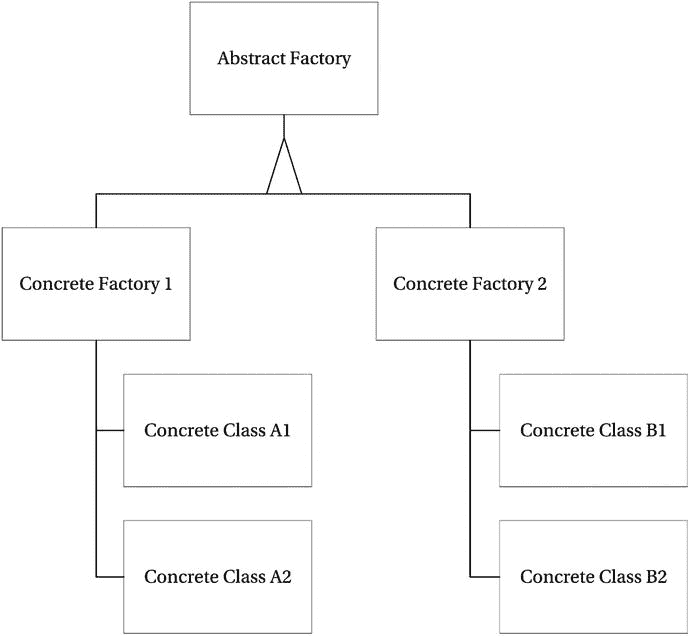

# 4.TypeScript 中的面向对象

构建软件设计有两种方式:一种是让它简单到没有明显缺陷，另一种是让它复杂到没有明显缺陷。第一种方法要困难得多。它需要同样的技能、投入、洞察力，甚至灵感，就像发现构成复杂自然现象基础的简单物理定律一样。—东尼·霍尔

面向对象编程允许用包含数据和相关行为的代码来表示现实世界中的概念。概念通常被建模为类，具有数据的属性和行为的方法，这些类的特定实例被称为对象。

这些年来已经有很多关于面向对象的讨论，我确信这场辩论在未来的许多年里仍然会很活跃。因为编程是一个启发式的过程，你很少会找到一个绝对的答案。这就是为什么你会在软件开发中经常听到“视情况而定”这句话。没有适合所有情况的编程范式，所以任何告诉你函数式编程、面向对象编程或其他编程风格是所有问题的答案的人都没有接触过足够多的复杂问题。正因为如此，编程语言变得越来越多元。

面向对象编程是计算机编程早期出现的许多良好实践的形式化。它提供了使这些良好实践更容易应用的概念。通过使用代码中的对象对问题领域中的真实世界对象进行建模，程序可以使用与它所服务的领域相同的语言。对象还允许封装或信息隐藏，这可以防止程序的不同部分修改程序的另一部分所依赖的数据。

支持面向对象等编程概念的最简单的解释不是来自软件世界，而是来自心理学。G. A .米勒发表了他的著名论文“神奇的数字七，正负二”(心理评论，1956 年)，描述了我们在任何一个时间可以在短期记忆中保持的信息数量的限制。我们的信息处理能力受限于我们能同时掌握的五到九条信息。这是任何代码组织技术的关键原因，在面向对象中，它应该驱动你走向抽象层，允许你首先浏览高层次的想法，并在需要时进一步深入细节层次。如果组织得好，维护代码的程序员在试图理解你的程序时，只需要掌握较少的并发信息。

Robert c . Martin(Bob 叔叔)在一次小组重构会议上以稍微不同的方式提出了这个想法，他说写得好的“礼貌的”代码就像读报纸一样。你可以扫描程序中的高级代码，就像它们是标题一样。维护代码的程序员会浏览标题以找到代码中的相关区域，然后深入查找实现细节。这种想法的价值来自于包含类似抽象层次代码的小型可读函数。报纸的比喻提供了干净代码的清晰愿景，但是减少认知开销的原则仍然存在。

## TypeScript 中的面向对象

TypeScript 提供了在程序中使用面向对象所需的所有关键工具。

*   班级
*   类的实例
*   方法
*   遗产
*   开放递归
*   包装
*   授权
*   多态性

第 [1](01.html) 章详细讨论了类、类的实例、方法和继承。这些是面向对象程序的组成部分，通过语言本身以一种简单的方式成为可能。对于每一个概念，你所需要的只是一两个语言关键词。

这个列表中的其他术语值得进一步解释，特别是关于它们如何在 TypeScript 类型系统中工作。下面几节详细阐述了开放递归、封装、委托和多态的概念，以及演示每个概念的代码示例。

Note

尽管本章详细讨论了面向对象，但是不要忘记 JavaScript 和 TypeScript 是一种多参数语言。特别是，即使您正在编写面向对象的代码，也不应该忽略一些优秀的函数编程特性。

### 开放递归

开放递归是递归和后期绑定的结合。当一个方法在一个类中调用它自己时，这个调用可以被转发到一个子类中定义的替换。清单 [4-1](#Par24) 是一个读取目录内容的类的例子。`FileReader`类根据提供的路径读取内容。任何文件都被添加到文件树中，但是在找到目录的地方，有一个对`this.getFiles`的递归调用。这些调用将继续，直到整个路径，包括所有子文件夹，都被添加到文件树中。`fs.` `reaaddirSync`和`fs.` `statSync`方法属于 NodeJS，这在第 [7](07.html) 章中有更详细的介绍。

Note

我使用了 NodeJS 文件系统调用的同步版本，`readdirSync`和`statSync`，因为它们使示例更加简单。在一个真实的程序中，你应该考虑使用标准的等价物，`readdir`和`stat`，它们是异步的并且接受回调函数。

`LimitedFileReader`是`FileReader`类的子类。当你创建一个`LimitedFileReader`类的实例时，你必须指定一个数字来限制这个类所代表的文件树的深度。这个例子展示了对`this.getFiles`的调用如何使用开放递归。如果您创建了一个`FileReader`实例，那么对`this.getFiles`的调用就是一个简单的递归调用。如果您创建了一个`LimitedFileReader`的实例，那么在`FileReader.getFiles`方法中对`this.getFiles`的调用实际上将被分派给`LimitedFileReader.getFiles`方法。

```js
import * as fs from 'fs';

interface FileItem {
    path: string;
    contents: string[];
}

class SyncFileReader {
    getFiles(path: string, depth: number = 0) {
        const fileTree = [];

        const files = fs.readdirSync(path);

        for (let file of files) {
            const stats = fs.statSync(file);

            let fileItem: FileItem;

            if (stats.isDirectory()) {
                // Add directory and contents
                fileItem = {
                    path: file,
                    contents: this.getFiles(file, (depth + 1))
                };
            } else {
                // Add file
                fileItem = {
                    path: file,
                    contents: []
                };
            }

            fileTree.push(fileItem);
        }

        return fileTree;
    }

}

class LimitedFileReader extends SyncFileReader {
    constructor(public maxDepth: number) {
        super();
    }

    getFiles(path: string, depth = 0) {
        if (depth > this.maxDepth) {
            return [];
        }

        return super.getFiles(path, depth);
    }
}

// instatiating an instance of LimitedFileReader
const fileReader = new LimitedFileReader(1);

// results in only the top level, and one additional level being read
const files = fileReader.getFiles('path'); 

Listing 4-1.
Open recursion

```

这个开放式递归的例子可以总结如下:

*   当你创建一个新的`SyncFileReader:`
    *   `fileReader.getFiles`是对`SyncFileReader.getFiles`的调用
    *   `this``.getFiles``SyncFileReader`内是对`SyncFileReader` `.getFiles`的称呼
*   当你创建一个新的`LimitedFileReader`
    *   `fileReader.getFiles`是对`LimitedFileReader.getFiles`的调用
    *   `super.getFiles`是对`SyncFileReader.getFiles`的调用
    *   `this``.getFiles``SyncFileReader`内是对`LimitedFileReader` `.getFiles`的称呼

开放递归的美妙之处在于原始类保持不变，并且不需要子类提供的专门化知识。子类可以重用超类的代码，这避免了重复。

### 包装

TypeScript 完全支持封装。类实例可以包含属性以及对这些属性进行操作的方法；这就是数据和行为的封装。还可以使用`private`访问修饰符来隐藏属性，它对类实例之外的代码隐藏数据。

封装的一个常见用途是数据隐藏:防止从类外部访问数据，除非通过显式操作。清单 [4-2](#Par40) 中的例子显示了一个具有`private total`属性的`Totalizer`类，该属性不能被`Totalizer`类之外的代码修改。当外部代码调用在类上定义的方法时，属性可能会更改。这消除了以下风险

*   外部代码添加捐赠而不添加退税；
*   未能验证金额的外部代码是正数；
*   调用代码中多处出现的退税计算；
*   外部代码中多处出现的税率。

```js
class Totalizer {
    private total = 0;
    private taxRateFactor = 0.2;

    addDonation(amount: number) {
        if (amount <= 0) {
            throw new Error('Donation exception');
        }

        const taxRebate = amount * this.taxRateFactor;
        const totalDonation = amount + taxRebate;

        this.total += totalDonation;
    }

    getAmountRaised() {
        return this.total;
    }
}

const totalizer = new Totalizer();

totalizer.addDonation(100.00);

const fundsRaised = totalizer.getAmountRaised();

// 120
console.log(fundsRaised);

Listing 4-2.
Encapsulation

```

封装是一种工具，它可以帮助你防止程序中大量的重复代码，但它并不能神奇地做到这一点。您应该使用`private`关键字隐藏您的属性，以防止外部代码更改该值或使用该值控制程序的流程。例如，最常见的一种复制是逻辑分支。`if`和`switch`语句，它们基于一个应该使用`private`关键字隐藏的属性来控制程序。当您更改属性时，您需要搜索所有这些逻辑分支，这会在整个代码中产生令人担忧的变化。

封装的最大好处是它极大地简化了理解代码的任务。类中的私有成员允许您理解成员的确切用法，而无需查看该类之外的任何代码。您可以保证成员的每次使用都在您面前，如果没有成员的使用，您可以删除它，因为没有其他代码依赖于它。

一旦增加了成员的可见性，如果不查看更广泛的代码集合，就无法理解如何使用它。如果您正在创作一个在其他程序中使用的包，您不可能理解该成员的所有用途，因此事情比私有成员要复杂得多。

### 授权

就程序重用而言，最重要的概念之一是委托。委托描述了程序的一部分将任务移交给另一部分的情况。在真正的委托中，包装器将对自身的引用传递给委托，这允许委托回调原始包装器，例如，包装器类将调用委托类，将关键字`this`传递给委托，允许委托调用包装器类上的公共方法。这允许包装类和委托类表现为子类和超类。

当包装器不传递对自身的引用时，这种操作在技术上被称为转发，而不是委托。在委托和转发中，你可以调用一个类上的方法，但是那个类把处理交给另一个类，如清单 [4-3](#Par47) 所示。如果两个类之间的关系没有通过“是一个”测试，委托和转发通常是继承的好选择。

Note

面向对象中的“是一个”测试包括描述对象之间的关系，以验证子类确实是超类的特殊版本。例如，“猫是哺乳动物”，“储蓄账户是银行账户。”当这种关系无效时，通常是显而易见的，例如，“一辆汽车是一个底盘”不起作用，但“一辆汽车有一个底盘”起作用。“有”关系需要委托(或转发)，而不是继承。

```js
interface ControlPanel {
    startAlarm(message: string): any;
}

interface Sensor {
    check(): any;
}

class MasterControlPanel {
    private sensors: Sensor[] = [];

    constructor() {
        // Instantiating the delegate HeatSensor
        this.sensors.push(new HeatSensor(this));
    }

    start() {
        for (let sensor of this.sensors) {
            sensor.check();
        }

        window.setTimeout(() => this.start(), 1000);
    }

    startAlarm(message: string) {
        console.log('Alarm! ' + message);
    }
}

class HeatSensor {
    private upperLimit = 38;
    private sensor = {
        read: function() { return Math.floor(Math.random() * 100); }
    };

    constructor(private controlPanel: ControlPanel) {
    }

    check() {
        if (this.sensor.read() > this.upperLimit) {
            // Calling back to the wrapper
            this.controlPanel.startAlarm('Overheating!');
        }
    }
}

const controlPanel = new MasterControlPanel();

controlPanel.start();

Listing 4-3.
Deleg

ation

```

清单 [4-3](#Par47) 是委托的一个简单例子。`ControlPanel`类将自己传递给`HeatSensor`构造函数，这使得`HeatSensor`类能够在需要时调用`ControlPanel`上的`startAlarm`方法。`ControlPanel`可以协调任意数量的传感器，如果检测到问题，每个传感器都可以回调到`ControlPanel`中发出警报。

可以对此进行扩展，以展示可以选择继承或委托的各种决策点。图 [4-1](#Fig1) 描述了汽车各部件之间的关系。底盘是建造汽车的普通骨架，是汽车的基本框架。当发动机、传动轴和变速器安装在底盘上时，这种组合称为滚动底盘。



图 4-1。

Encapsulation and inheritance

对于图表中的每种关系，试着阅读“是 a”和“有 a”选项，看看你是否同意所示的关系。在面向对象编程中，我们在这些检查期间暂停语法，所以您永远不需要使用“is an”或“has an”

### 多态性

在编程中，多态性指的是指定一个契约并让许多不同类型实现该契约的能力。使用实现某些约定的类的代码不需要知道具体实现的细节。在 TypeScript 中，可以使用几种不同的形式实现多态性:

*   由许多类实现的接口；
*   由许多对象实现的接口；
*   由许多函数实现的接口；
*   有许多专门子类的超类；
*   任何有许多相似结构的结构。

最后一点，“具有许多相似结构的任何结构”指的是 TypeScript 的结构类型系统，它将接受与所需类型兼容的结构。这意味着你可以用两个具有相同签名和返回类型的函数(或者两个具有兼容结构的类，或者两个具有相似结构的对象)实现多态性，即使它们没有显式地实现一个命名类型，如清单 [4-4](#Par58) 所示。

```js
interface Vehicle {
    moveTo(x: number, y: number);
}

// Explicit interface implementation
class Car implements Vehicle {
    moveTo(x: number, y: number) {
        console.log('Driving to ' + x + ' ' + y);
    }
}

class SportsCar extends Car {

}

// Doesn't explicitly implement the Vehicle interface
class Airplane {
    moveTo(x: number, y: number) {
        console.log('Flying to ' + x + ' ' + y);
    }
}

class Satellite {
    moveTo(x: number) {
        console.log('Targeting ' + x);
    }
}

function navigate(vehicle: Vehicle) {
    vehicle.moveTo(59.9436499, 10.7167959);
}

const car = new SportsCar();
navigate(car);

const airplane = new Airplane();
navigate(airplane);

const satellite = new Satellite();
navigate(satellite);

Listing 4-4.Polymorphism

```

清单 [4-4](#Par58) 展示了 TypeScript 中的多态性。`navigate`函数接受与`Vehicle`接口兼容的任何类型。具体来说，这意味着任何具有名为`moveTo`的方法的类或对象，该方法最多接受两个类型为`number`的参数。

Note

重要的是要记住，如果一个方法接受的参数较少，那么它与另一个方法在结构上是兼容的。在许多语言中，即使没有在方法体中使用冗余参数，您也会被迫指定该参数，但是在 TypeScript 中，您可以省略它。如果协定指定了参数，调用代码仍然可以传递它，这保留了多态性。

清单 [4-4](#Par58) 中的`navigate`函数将指定的`Vehicle`发送到奥斯陆的挪威计算中心——多态是在奥斯陆由奥利·约翰·达尔和克利斯登·奈加特创建的。

示例中定义的所有类型都与`Vehicle`定义兼容；`Car`显式实现了接口，`SportsCar`继承了`Car`，所以它也实现了`Vehicle`接口。`Airplane`没有显式实现`Vehicle`接口，但它有一个兼容的`moveTo`方法，并将被`navigate`函数接受。`Satellite`类代表一辆具有固定“y”坐标的车辆，这意味着只能控制“x”坐标。此类型仍然兼容，因为 TypeScript 中允许具有较少参数的类型。基于兼容类型的结构接受兼容类型是 TypeScript 的结构类型系统的一个特性，这将在第 [3](03.html) 章中描述。

## 坚实的原则

与任何编程范例一样，面向对象并不能防止混乱或不可维护的程序。这就是五个启发式设计准则通常被称为坚实原则的原因。

这些坚实的原则被罗伯特·c·马丁编入目录，并在一系列在线文章和几本书( [`http://www.objectmentor.com/resources/articles/Principles_and_Patterns.pdf`](http://www.objectmentor.com/resources/articles/Principles_and_Patterns.pdf) )中进行了描述，2000；C#中的敏捷原则、模式和实践(Prentice Hall，2006)。一段时间后，Michael Feathers 发现了“SOLID”这个缩写词。幸运的是，原则的顺序并不重要，所以它们可以按照这种更容易记忆的形式进行排序。这些原则旨在成为支撑面向对象编程和设计的基本原则。一般来说，这些原则为创建可读和可维护的代码提供了指导。

重要的是要记住，软件设计是一个启发式的过程。不可能创建像清单一样可以遵循的规则。坚实的原则是帮助你从面向对象的角度考虑程序设计的指导方针，可以帮助你作出在你的特定环境下工作的明智的设计决定。这些原则还提供了一种共享语言，可以用来与其他程序员讨论设计。

这五个坚实的原则是:

*   单一责任原则——一个类应该有且只有一个改变的理由。
*   开放-封闭原则——应该可以扩展一个类的行为而不用修改它。
*   利斯科夫替换原则——子类应该可以替换它们的超类。
*   接口分离原则——许多小型的、特定于客户端的接口比一个通用接口要好。
*   依赖倒置原则——依赖抽象，而不是具体化。

这五个坚实的原则将在接下来的章节中分别讨论。

### 单一责任原则

SRP 要求一个类应该只有一个改变的理由。当设计你的类时，你应该把相关的特性放在一起，确保它们可能因为相同的原因而改变，如果它们因为不同的原因而改变，就把它们分开。遵循这一原则的程序有只执行一些相关任务的类。这样的计划很可能具有高度的凝聚力。

术语内聚性指的是一个类或模块中的特性的相关性的度量。如果特性是不相关的，那么这个类的内聚性就很低，并且可能会因为许多不同的原因而改变。SRP 的正确应用会产生高内聚力。

当你在程序中添加代码时，你需要有意识地决定它属于哪里。大多数违反这一原则的情况并不是来自方法与其封闭类明显不匹配的明显情况。对于一个类来说，在一段时间内，在许多不同的程序员的关注下，逐渐超越其最初的目的要常见得多。

当考虑 SRP 时，你不需要将你的思维局限于类，因为原则具有分形性。您可以将该原则应用于方法，确保它们只做一件事，因此只有一个理由进行更改。您还可以将这一原则应用到模块中，确保模块在总体上有一个单独的职责范围。

清单 [4-5](#Par78) 显示了一个典型的违反 SRP 的情况。乍一看，所有的方法似乎都属于`Movie`类，因为它们都使用电影的属性来执行操作。然而，持久性逻辑的出现模糊了将`Movie`类用作对象和将其用作数据结构之间的界限。

```js
class Movie {
    private db: DataBase;

    constructor(private title: string, private year: number) {
        this.db = DataBase.connect('user:pw@mydb', ['movies']);
    }

    getTitle() {
        return this.title + ' (' + this.year + ')';
    }

    save() {
        this.db.movies.save({ title: this.title, year: this.year });
    }
}

// Movie
const movie = new Movie('The Internship', 2013);

movie.save();

Listing 4-5.Single responsibility principle (SRP) violation

```

为了在这个类变成一个更大的问题之前修复它，这两个问题可以在负责电影相关行为的`Movie`类和负责存储数据的`MovieRepository`类之间进行划分，如清单 [4-6](#Par80) 所示。如果特性被添加到`Movie`类，那么`MovieRepository`不需要任何改变。如果你要改变你的数据存储设备，`Movie`类不需要改变。

```js
class Movie {
    constructor(private title: string, private year: number) {
    }

    getTitle() {
        return this.title + ' (' + this.year + ')';
    }
}

class MovieRepository {
    private db: DataBase;

    constructor() {
        this.db = DataBase.connect('user:pw@mydb', ['movies']);
    }

    save(movie: Movie) {
        this.db.movies.save(JSON.stringify(movie));
    }
}

// Movie
const movie = new Movie('The Internship', 2013);

// MovieRepository
const movieRepository = new MovieRepository();

movieRepository.save(movie);

Listing 4-6.Separate reasons for change

```

如果您记住了单一责任原则，那么关注类级别的责任通常是简单的，但是在方法级别它可能更加重要，确保每个方法只执行一个任务，并且以揭示方法预期行为的方式命名。Bob 叔叔创造了一个短语“extract ' til you drop”，指的是重构你的方法，直到每个方法只有很少的几行，只能做一件事。这种广泛重构方法的实践很容易就值得重新设计。

### 开闭原则(OCP)

OCP 经常被总结为这样一句话:软件实体应该对扩展开放，但对修改关闭。从实用的角度来说，不管你预先设计了多少程序，几乎可以肯定的是，它不会完全被保护起来不被修改。但是，更改现有类的风险是，您会无意中引入行为更改，这会影响到依赖于该类的代码。自动化测试可以在一定程度上(但不是完全)减轻这种情况，这在第 [10](10.html) 章中有所描述。

为了遵循 OCP，你需要考虑你的程序中可能改变的部分。例如，您可以尝试识别任何包含将来可能要替换或扩展的行为的类。这种方法的一个小问题是，通常不可能预测未来，而且如果你引入的代码打算在以后得到回报，那么它几乎总是不会有回报。试图猜测可能会发生什么可能会很麻烦，要么是因为结果证明代码永远不需要，要么是因为真实的未来与预测不兼容。所以，你需要务实地对待这个原则，这有时意味着只有当你在现实生活中第一次遇到问题时，才引入代码来解决问题。

记住这些警告，遵循 OCP 的一个常见方法是用一个类替换另一个类以获得不同的行为。在大多数面向对象语言中，这是一件相当简单的事情，TypeScript 也不例外。清单 [4-7](#Par86) 显示了一个名为`RewardPointsCalculator`的奖励卡积分计算类。奖励积分的标准数字是“在商店消费的每一整美元获得四个积分。”当决定向一些 VIP 客户提供双倍积分时，不是在原来的`RewardPointsCalculator`类中添加一个条件分支，而是创建一个名为`DoublePointsCalculator`的子类来处理新的行为。在这种情况下，子类调用超类上的原始`getPoints`方法，但是它也可以完全忽略原始类，按照自己希望的方式计算点数。

如果决定只对某些符合条件的购买给予奖励积分，那么在调用原始的`RewardPointsCalculator`之前，一个类可以处理基于交易类型的过滤——同样，扩展应用程序的行为，而不是修改现有的`RewardPointsCalculator`类。

```js
class RewardPointsCalculator {
    getPoints(transactionValue: number) {
        // 4 points per whole dollar spent
        return Math.floor(transactionValue) * 4;
    }
}

class DoublePointsCalculator extends RewardPointsCalculator {
    getPoints(transactionValue: number) {
        const standardPoints = super.getPoints(transactionValue);
        return standardPoints * 2;
    }
}

const pointsCalculator = new DoublePointsCalculator();

// 800
alert(pointsCalculator.getPoints(100.99));

Listing 4-7.Open–closed principle (OCP)

```

通过遵循 OCP，程序更有可能包含可维护和可重用的代码。通过避免现有类中的返工，您还可以避免变更后可能在整个程序中回响的冲击波。已知有效的代码保持不变，并添加新的代码来处理新的需求。

### 利斯科夫替代原理(LSP)

在《数据抽象和层次》中，芭芭拉·利斯科夫( [`http://www.sr.ifes.edu.br/∼mcosta/disciplinas/20091/tpa/recursos/p17-liskov.pdf`](http://www.sr.ifes.edu.br/%E2%88%BCmcosta/disciplinas/20091/tpa/recursos/p17-liskov.pdf) ，1988)写道，

> What is needed here is a substitution attribute similar to the following: if there is a T-type object o2 for every S-type object o1, so that for all programs P defined by T, when o1 replaces o2, the behavior of P is unchanged, then S is a subtype of T. -Barbara Liskov

其本质是，如果用一个子类替换一个超类，使用该类的代码不需要知道替换已经发生。如果您发现自己在程序中测试一个对象的类型，那么很有可能您违反了 LSP。这个原则的具体需求将在后面描述，使用一个超级`Animal`类的例子，以及从`Animal`继承而来的`Cat`的子类。

*   子类型中方法参数的矛盾:如果超类有一个接受`Cat`的方法，子类方法应该接受类型`Cat`或`Animal`的参数，这是`Cat`的超类。
*   子类型中返回类型的协方差:如果超类有一个返回`Animal`的方法，子类方法应该返回一个`Animal`，或者是`Animal`的一个子类，比如`Cat`。
*   子类型应该抛出与超类型相同的异常，或者抛出作为超类型异常的子类型的异常:在 TypeScript 中，不局限于使用异常类；您可以简单地指定一个字符串来抛出异常。可以为 TypeScript 中的错误创建类，如清单 [4-8](#Par95) 所示。这里的关键是，如果调用代码有一个异常处理块，它不应该对子类抛出的异常感到惊讶。在第 [8](08.html) 章中有更多关于异常处理的信息。

```js
class ApplicationError implements Error {
    constructor(public name: string, public message: string) {

    }
}

throw new ApplicationError('Example Error', 'An error has occurred');

Listing 4-8.Error classes

```

LSP 通过确保当新的行为被添加到程序中时，新的代码可以被用来代替旧的代码来支持 OCP。如果一个子类不能直接代替一个超类，那么添加一个新的子类将导致整个代码的改变，甚至可能导致程序流被基于对象类型的分支条件所控制。

### 接口隔离原则(ISP)

发现接口本质上只是整个类的描述是很常见的。这通常是在类之后编写接口的情况。清单 [4-9](#Par98) 显示了一个打印机接口的简单例子，它可以复印、打印和装订文档。因为界面只是描述打印机所有行为的一种方式，它会随着新功能的增加而增长，例如，折叠、插入信封、传真、扫描和电子邮件可能最终会出现在`Printer`界面上。

```js
interface Printer {
    copyDocument();
    printDocument(document: Document);
    stapleDocument(document: Document, tray: number);
}
Listing 4-9.
Printer interface

```

ISP 声明我们不应该创建这些大的接口，而是编写一系列更小、更具体的接口，由类来实现。每个接口将描述一组独立的行为，允许代码依赖于一个只提供所需行为的小接口。不同的类可以提供这些小接口的实现，而不必实现其他不相关的功能。

清单 [4-9](#Par98) 中的`Printer`接口使得实现一个可以打印和复制，但不能装订的打印机变得不可能——或者更糟的是，必须实现装订方法来抛出一个错误，表明操作无法完成。随着接口越来越大，打印机满足`Printer`接口的可能性会随着时间的推移而降低，并且很难向接口添加新方法，因为它会影响多个实现。清单 [4-10](#Par101) 显示了另一种方法，它将方法分组到更具体的接口中，这些接口描述了许多契约，这些契约可以由简单的打印机或简单的复印机单独实现，也可以由无所不能的超级打印机实现。

```js
interface Printer {
    printDocument(document: Document);
}

interface Stapler {
    stapleDocument(document: Document, tray: number);
}

interface Copier {
    copyDocument();
}

class SimplePrinter implements Printer {
    printDocument(document: Document) {
        //...
    }
}

class SuperPrinter implements Printer, Stapler, Copier {
    printDocument(document: Document) {
        //...
    }

    copyDocument() {
        //...
    }

    stapleDocument(document: Document, tray: number) {
        //...
    }
}

Listing 4-10.
Segregated interfaces

```

当您遵循 ISP 时，客户端代码不会被迫依赖于它不打算使用的方法。大型接口倾向于调用组织在类似大型 chun 中的代码，而一系列小型接口允许客户端实现小型的可维护适配器来与接口通信。

### 依赖性倒置原则

在传统的面向对象程序中，高层组件依赖于分层结构中的低层组件。组件之间的耦合导致了一个僵化的系统，它很难改变，并且在引入改变时会失败。重用一个模块也变得很困难，因为如果不带来一系列的依赖关系，它就不能被移动到一个新程序中。

清单 [4-11](#Par105) 显示了一个简单的传统依赖的例子。高级别的`LightSwitch`类依赖于低级别的`Light`类。

```js
class Light {
    switchOn() {
        //...
    }

    switchOff() {
        //...
    }
}

class LightSwitch {
    private isOn = false;

    constructor(private light: Light) {
    }

    onPress() {
        if (this.isOn) {
            this.light.switchOff();
            this.isOn = false;
        } else {
            this.light.switchOn();
            this.isOn = true;
        }
    }
}

Listing 4-11.High-level dependency on low-level class

```

DIP 简单地说明了高级模块不应该依赖于低级组件，而应该依赖于抽象。反过来，抽象不应该依赖于细节，而应该依赖于更多的抽象。简单地说，你可以通过依赖一个接口而不是一个类来满足这个需求。

清单 [4-12](#Par108) 展示了 DIP 实践的第一步，简单地添加一个`LightSource`接口来打破`LightSwitch`和`Light`类之间的依赖关系。我们可以通过将`LightSwitch`抽象成`Switch`接口来延续这种设计；`Switch`接口将依赖于`LightSource`接口，而不是底层的`Light`类。

```js
interface LightSource {
    switchOn();
    switchOff();
}

class Light implements LightSource {
    switchOn() {
        //...
    }

    switchOff() {
        //...
    }
}

class LightSwitch {
    private isOn = false; 

    constructor(private light: LightSource) {
    }

    onPress() {
        if (this.isOn) {
            this.light.switchOff();
            this.isOn = false;
        } else {
            this.light.switchOn();
            this.isOn = true;
        }
    }
}

Listing 4-12.Implementing the dependency inversion principle (DIP)

```

DIP 扩展了 OCP 和 LSP 的概念。通过依赖抽象，代码与类的具体实现细节的联系就不那么紧密了。这个原则有很大的影响，但是它相对容易遵循，因为您需要做的只是提供一个抽象类或一个接口(或多个接口，记住接口分离原则)来依赖，而不是一个具体的类。

## 设计模式

在软件中，设计模式提供了一个已知问题的目录，以及针对所描述的每个问题的设计解决方案。这些模式并不过分规范；相反，它们提供了一套工具，您可以在每次使用它们时以不同的方式进行排列。最常见的设计模式的权威来源是“四人帮”的原著《设计模式:可重用面向对象软件的元素》(Gamma，Helm，Johnson & Vlissides，Addison Wesley，1995)。

正如 Diaz 和 Harmes(Pro JavaScript Design Patterns，Apress，2007)所示，可以将这些设计模式转换为 JavaScript，如果可以用普通 JavaScript 完成，也可以用 TypeScript 完成。由于 TypeScript 中提供的基于类的面向对象，从传统设计模式示例到 TypeScript 的转换在许多情况下更加自然。

TypeScript 是设计模式的天然选择，因为它提供了使用原始目录中的所有创建、结构和行为模式所需的所有语言构造，以及自那以后的许多文档。下一节将描述设计模式的一个小样本，以及 TypeScript 代码示例。

下面的例子演示了策略模式和抽象工厂模式。这些只是四人组原著中描述的 24 种模式中的两种。这些模式将在下面进行概述，然后用来改进一个小程序的设计。

Note

虽然您可能对设计模式有一个预先的想法，这可能会改进您的程序的设计，但更常见的是，当您的程序增长时，让模式浮现出来，这通常是更可取的。如果您预测可能需要的模式，那么您可能猜错了。如果在扩展时让代码暴露问题，就不太可能创建大量不必要的类，也不太可能在错误的设计中迷失方向。

### 战略模式

策略模式允许您封装不同的算法，使每一个算法都可以相互替代。在图 [4-2](#Fig2) 中，上下文类将依赖于策略，它为具体的实现提供了接口。任何实现该接口的类都可以在运行时传递给上下文类。

本节后面的实际例子中展示了一个策略模式的例子。



图 4-2。

The strategy pattern

### 抽象工厂模式

抽象工厂模式是一种创造性的设计模式。它允许您为相关对象的创建指定一个接口，而无需指定它们的具体类。这种模式的目的是让类依赖于抽象工厂的行为，抽象工厂将由不同的具体类来实现，这些具体类在编译时或运行时会发生变化。

图 [4-3](#Fig3) 和下文中的实际例子显示了抽象工厂模式的一个例子。



图 4-3。

The abst ract factory pattern

### 实际例子

为了说明策略和抽象工厂设计模式的使用，我们将使用一个洗车的例子。洗车场可以根据司机的花费进行不同等级的清洗。清单 [4-13](#Par120) 说明了车轮清洁策略，它包括一个车轮清洁类的接口，以及两个提供基本或执行清洁的策略。

```js
interface WheelCleaning {
    cleanWheels(): void;
}

class BasicWheelCleaning implements WheelCleaning {
    cleanWheels() {
        console.log('Soaping Wheel');
        console.log('Brushing wheel');
    }
}

class ExecutiveWheelCleaning extends BasicWheelCleaning {
    cleanWheels() {
        super.cleanWheels();
        console.log('Waxing Wheel');
        console.log('Rinsing Wheel');
    }
}

Listing 4-13.Wheel cleaning

```

清单 [4-14](#Par122) 展示了清洁汽车车身的策略。这类似于清单 [4-13](#Par120) 中的`WheelCleaning`示例，但这不是必须的。当我们稍后将示例转换为使用抽象工厂模式时，`WheelCleaning`和`BodyCleaning`代码都不会改变。

```js
interface BodyCleaning {
    cleanBody(): void;
}

class BasicBodyCleaning implements BodyCleaning {
    cleanBody() {
        console.log('Soaping car');
        console.log('Rinsing Car');
    }
}

class ExecutiveBodyCleaning extends BasicBodyCleaning {
    cleanBody() {
        super.cleanBody();
        console.log('Waxing car');
        console.log('Blow drying car');
    }
}

Listing 4-14.
Body cleaning

```

清单 [4-15](#Par124) 显示了更新使用抽象工厂模式之前的`CarWashProgram`类。这是一个知道的太多的阶层的典型例子。它与具体的清理类紧密耦合，负责根据所选的程序创建相关的类。

```js
class CarWashProgram {
    constructor(private washLevel: number) {

    }

    runWash() {
        let wheelWash: WheelCleaning;
        let bodyWash: BodyCleaning;

        switch (this.washLevel) {
            case 1:
                wheelWash = new BasicWheelCleaning();
                wheelWash.cleanWheels();

                bodyWash = new BasicBodyCleaning();
                bodyWash.cleanBody();

                break;
            case 2:
                wheelWash = new BasicWheelCleaning();
                wheelWash.cleanWheels();

                bodyWash = new ExecutiveBodyCleaning();
                bodyWash.cleanBody();

                break;
            case 3:
                wheelWash = new ExecutiveWheelCleaning();
                wheelWash.cleanWheels();

                bodyWash = new ExecutiveBodyCleaning();
                bodyWash.cleanBody();

                break;
        }
    }
}

Listing 4-15.
CarWashProgram class

before the abstract factory pattern

```

抽象工厂本身是一个描述每个具体工厂可以执行的操作的接口。在清单 [4-16](#Par126) 中，`ValetFactory`接口提供了方法签名，用于获取提供车轮清洁功能的类和提供车身清洁功能的类。需要清理车轮和车身的类可以依赖于这个接口，并与指定实际清理的类保持分离。

```js
interface ValetFactory {
    getWheelCleaning() : WheelCleaning;
    getBodyCleaning() : BodyCleaning;
}
Listing 4-16.Abstract factory

```

在清单 [4-17](#Par128) 中，声明有三家混凝土工厂提供青铜级、白银级或黄金级清洗。每个工厂都提供适当的清洗等级，与所需的清洗等级相匹配。

```js
class BronzeWashFactory implements ValetFactory {
    getWheelCleaning() {
        return new BasicWheelCleaning();
    }

    getBodyCleaning() {
        return new BasicBodyCleaning();
    }
}

class SilverWashFactory implements ValetFactory {
    getWheelCleaning() {
        return new BasicWheelCleaning();
    }

    getBodyCleaning() {
        return new ExecutiveBodyCleaning();
    }
}

class GoldWashFactory implements ValetFactory {
    getWheelCleaning() {
        return new ExecutiveWheelCleaning();
    }

    getBodyCleaning() {
        return new ExecutiveBodyCleaning();
    }
}

Listing 4-17.Concrete factories

```

清单 [4-18](#Par130) 展示了使用抽象工厂模式更新的类。`CarWashProgram`类不再知道将执行洗车操作的具体类。`CarWashProgram`现在由适当的工厂构建，该工厂将提供执行清理的类。这可以通过编译时机制或动态运行时机制来完成。

```js
class CarWashProgram {
    constructor(private cleaningFactory: ValetFactory) {

    }

    runWash() {
        const wheelWash = this.cleaningFactory.getWheelCleaning();
        wheelWash.cleanWheels();

        const bodyWash = this.cleaningFactory.getBodyCleaning();
        bodyWash.cleanBody();
    }
}

Listing 4-18.Abstract factory pattern in use

```

## 混入类

Mixins 提供了另一种编写应用程序的方法，这在设计模式的书籍中没有明确涉及。

Mixins 得名于一种可定制的冰淇淋甜点，这种甜点最早出现在马萨诸塞州萨默维尔的史蒂夫冰淇淋店里。混合甜点背后的想法是，你选择一个冰淇淋，并添加另一种产品来调味，例如，一个糖果棒。自 1973 年出现在史蒂夫·赫瑞尔的菜单上以来，混合冰淇淋的概念已经风靡全球。

在编程中，mixins 基于非常相似的概念。扩充类是通过将 mixin 类组合在一起而创建的，每个 mixin 类提供一个小的可重用行为。这些 mixin 类部分是接口，部分是实现。

### 类型脚本混合

TypeScript 中有两种混合样式:原始的简单混合样式和较新的真实混合样式。简单的混音是在一个执行连接的附加函数的帮助下实现的。应用混合的功能如清单 [4-19](#Par135) 所示。这个函数遍历在`baseCtors`数组中传递的每个 mixin 类的实例成员，并将它们添加到`derivedCtor`类中。每当您想要将 mixins 应用到一个类时，您将使用这个函数，并且您将在本节的示例中看到这个函数的使用。

```js
function applyMixins(derivedCtor: any, baseCtors: any[]) {
    baseCtors.forEach(baseCtor => {
        Object.getOwnPropertyNames(baseCtor.prototype).forEach(name => {
            derivedCtor.prototype[name] = baseCtor.prototype[name];
        });
    });
}
Listing 4-19.Mixin enabler function

```

一旦在程序中的某个地方添加了这个函数，就可以开始使用 mixins 了。在清单 [4-20](#Par137) 中，定义了一系列小型的可重用 mixin 类。这些类没有特定的语法。在这个例子中，我们定义了一系列可能的行为，`Sings`、`Dances`和`Acts`。这些类充当行为菜单，可以混合在一起创建由不同组合组成的不同风格。

```js
class Sings {
    sing() {
        console.log('Singing');
    }
}

class Dances {
    dance() {
        console.log('Dancing');
    }
}

class Acts {
    act() {
        console.log('Acting');
    }
}

Listing 4-20.
Reusable classes

```

就其本身而言，这些类太小而没有用，但是它们非常严格地遵守单一责任原则。您并不局限于单个方法，而是每个类代表一个行为，您可以在类名中对其进行总结。为了使这些混合有用，您需要将它们组合成可用的扩充类。

在 TypeScript 中，您使用`implements`关键字，后跟一个逗号分隔的 mixins 列表来组成您的 mix 类。`implements`关键字向 mixins 就像实现附带的接口这一事实致敬。您还需要提供与您组合的所有混音相匹配的临时属性，如清单 [4-21](#Par141) 所示。当在类声明后直接调用`applyMixins`函数时，这些属性将被替换。

没有任何东西可以确保您使用与您在`implements`语句中列出的相同的类集合来调用`applyMixins`函数。您负责保持两个列表同步。

```js
class Actor implements Acts {
    act: () => void;
}

applyMixins(Actor, [Acts]);

class AllRounder implements Acts, Dances, Sings {
    act: () => void;
    dance: () => void;
    sing: () => void;
}

applyMixins(AllRounder, [Acts, Dances, Sings]);

Listing 4-21.
Composing classes

```

`Actor`和`AllRounder`类没有真正的实现，只有由 mixins 提供的实现的占位符。这意味着对于任何给定的行为，程序中只有一个地方需要改变。在你的程序中使用一个扩充类和使用任何其他类没有什么不同，如清单 [4-22](#Par143) 所示。

```js
const actor = new Actor();
actor.act();

const allRounder = new AllRounder();
allRounder.act();
allRounder.dance();
allRounder.sing();

Listing 4-22.Using the classes

```

Note

您可能已经发现 mixins 看起来有点像多重继承。TypeScript 中不允许多重继承。mixins 的关键是使用`implements`关键字，而不是`extends`关键字，这使得它们更像接口而不是超类。

### 何时使用 Mixins

Mixins 在 TypeScript 中已经有了一些支持——但是在使用它们的时候应该记住什么呢？首先，没有检查将实现添加到扩充类的机制，所以在使用正确的类名列表调用`applyMixins`函数时必须非常小心。这是您想要充分测试以避免任何令人讨厌的意外的一个方面。

关于是使用混合还是经典继承的决定通常取决于类之间的关系。当在继承和委托之间做出决定时，通常使用“是一个”诗句“有一个”测试。如本章前面所述。

*   汽车有底盘。
*   滚动底盘是一种底盘。

只有在句子中“是”的关系起作用时，才使用继承，而在“有”更有意义时，才使用删除。对于 mixins，这种关系最好用“能做”关系来描述，例如:

*   演员可以做表演。或者
*   演员表演。

您可以通过用像`Acting`或`Acts`这样的名字来命名您的 mixins 来加强这种关系。这让你的课读起来像一句话，比如“演员实施表演。”

mixin 应该允许将小单元组合成更大的单元，所以下面的场景是使用 mixin 的好选择:

*   用可选的特性组成类，mixins 是选项。
*   在许多类中重用相同的行为。
*   基于相似的功能列表创建许多变体。

### 限制

不能对私有成员使用 mixins，因为如果成员没有在扩充类中实现，编译器将生成错误。如果 mixin 和 augmented 类都定义了同名的私有成员，编译器也会产生错误。

对 mixins 的另一个限制是，尽管方法实现被映射到扩充类，但属性值没有被映射；清单 [4-23](#Par160) 展示了这一点。当你从 mixin 中实现一个属性时，你需要在扩展类中初始化它。为了避免混淆，最好在 mixin 中定义一个必需的属性，但是不要提供默认值。

```js
class Acts {
    public message = 'Acting';

    act() {
        console.log(this.message);
    }
}

class Actor implements Acts {
    public message: string;
    act: () => void;
}

applyMixins(Actor, [Acts]);

const actor = new Actor();

// Logs 'undefined', not 'Acting'
actor.act();

Listing 4-23.Properties not mapped

```

如果属性不需要绑定到实例，您可以使用静态属性，因为这些属性在从 mixin 映射到 augmented 类的方法中仍然可用。清单 [4-24](#Par162) 是对清单 [4-23](#Par160) 的更新，它使用静态属性解决了这个问题。如果您确实需要每个实例有不同的值，那么应该在扩充的类中初始化实例属性。

```js
class Acts {
    public static message = 'Acting';

    act() {
        alert(Acts.message);
    }
}

class Actor implements Acts {
    act: () => void;
}

applyMixins(Actor, [Acts]);

const actor = new Actor();

// Logs 'Acting'
actor.act();

Listing 4-24.Static properties are available

```

### 真正的混音

真正的混合为使用混合支持合成提供了更可靠的机制。清单 [4-25](#Par165) 显示了创建一个演员的等价混音。`Constructor`类型是对象的通用类型，其构造函数接受零个或多个参数。mixin 是在`Acts`函数中定义的，它用一个`message`属性和一个`act`方法扩展了任何提供的类。

要将 mixin 应用于一个类，只需调用`Acts`函数，传递目标类。无论何时调用生成的 mix 类，它都会有其原始成员，以及 mixin 的附加成员。

```js
type Constructor<T = {}> = new (...args: any[]) => T;

function Acts<TBase extends Constructor>(Base: TBase) {
    return class extends Base {
        message: string = 'Acting';
        act() {
            alert(this.message);
        }
    };
}

class Person {
    constructor(private name: string) {

    }
}

const Actor = Acts(Person);

const actor = new Actor('Alan');

// Acting
actor.act();

Listing 4-25.
Real 

mixins.

```

为了展示创建一个具有多个混音的混音类的比较案例，清单 [4-26](#Par167) 中显示了歌唱、舞蹈、表演简单混音的完整真实混音等价物。

```js
type Constructor<T = {}> = new (...args: any[]) => T;

function Sings<TBase extends Constructor>(Base: TBase) {
    return class extends Ba

se {
        sing() {
            alert('Singing');
        }
    };
}

function Dances<TBase extends Constructor>(Base: TBase) {
    return class extends Base {
        dance() {
            alert('Dancing');
        }
    };
}

function Acts<TBase extends Constructor>(Base: TBase) {
    return class extends Base {
        act() {
            alert('Acting');
        }
    };
}

class Person {
    constructor(private name: string) {

    }
}

const Actor = Acts(Person);

const AllRounder = Acts(Sings(Dances(Person)));

const actor = new Actor('Alan');
actor.act();

const allRounder = new AllRounder('Gene');
allRounder.act();
allRounder.dance();
allRounder.sing();

Listing 4-26.The full real mixins

```

真正混合的好处包括消除了忘记调用应用混合函数的可能性，以及对所有成员的支持。语法需要做一些工作，但是一旦有了构造函数类型，剩下的就相当简单了。

## 摘要

面向对象的所有构造块都存在于 TypeScript 中。语言工具可以将您在使用其他语言时学到的所有面向对象的原则和实践应用到您的程序中，使用可靠的原则来指导您的写作，并将设计模式作为常见问题的成熟解决方案的参考。

面向对象本身并不能解决编写和维护解决复杂问题的程序的问题。使用面向对象编写糟糕的代码就像在任何其他编程范例中编写糟糕的代码一样；这就是模式和原则如此重要的原因。本章中的面向对象元素补充了第 [10](10.html) 章中的测试技术。

您可以使用编码卡塔练习和提高您的面向对象设计技能以及单元测试技能。这些在附录 4 中有描述，有一些例子供你尝试。

## 要点

*   TypeScript 拥有编写面向对象程序所需的所有工具。
*   坚实的原则旨在保持代码的可延展性，防止它腐烂。
*   设计模式是对常见问题的现有的、众所周知的解决方案。
*   您不必完全按照描述来实现设计模式。
*   混合蛋白为合成提供了另一种机制。