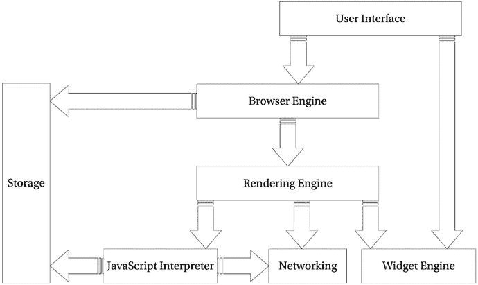
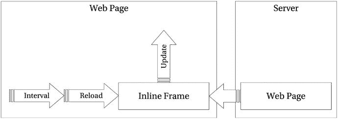
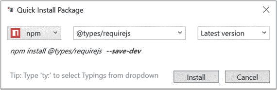
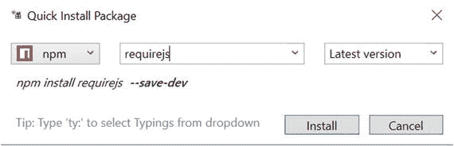

# 6.在浏览器中运行 TypeScript

所有现代的网络浏览器——在台式机、游戏机、平板电脑和智能手机上——都包含 JavaScript 解释器，这使得 JavaScript 成为历史上最普遍的编程语言。—大卫·弗拉纳根

尽管有许多不同的环境可能是 TypeScript 程序的目标，但最广泛的运行时类别之一肯定是 web 浏览器。本章首先介绍 web 浏览器的一般设计，然后介绍与网页交互、向 web 服务器发出异步请求、在用户的本地计算机上存储数据以及访问硬件传感器的实际示例。在本章的最后，有关于模块化你的程序和按需加载模块的信息。

Note

本章中描述的一些功能是实验性的，对浏览器的支持有限。要了解哪些浏览器支持任何特定功能，请访问亚历克西斯·德弗里亚的“我可以使用吗”项目( [`http://caniuse.com/`](http://caniuse.com/) ，2014)。

## 网络浏览器的剖析

网络浏览器已经从 20 世纪 90 年代简单的文档显示迅速发展到今天成熟的应用环境和 3D 游戏显示。对插件、小程序和下载的依赖正在快速减少，因为视频、音频和游戏都将文档、图像和应用程序加入到 web 浏览器的 HTML 文档中。

如果你的程序要依靠浏览器来工作，了解一点关于浏览器的知识是值得的，但是如果浏览器的细节和一些重要特性的历史没有引起普遍的兴奋感，或者如果你已经知道了关于浏览器的所有知识，请随意跳到下一节，这是一个更实际的部分。如果你想知道更多关于网络浏览器的工作原理，请继续阅读。

网络浏览器通常由图 [6-1](#Fig1) 所示的组件组成。用户界面

*   浏览器引擎
*   渲染引擎
*   Widget 引擎
*   JavaScript 解释器
*   建立关系网
*   仓库

用户界面包括出现在所有 web 浏览器窗口上的所有按钮和文本框，例如地址栏、后退和前进按钮以及刷新按钮。浏览器引擎和渲染引擎处理内容显示，内容显示占据了 web 浏览器显示的主要区域。小部件引擎为用户界面和呈现引擎提供常见的用户控件，如文本输入、下拉列表和按钮。



图 6-1。

Web browser components

为了显示网页，浏览器引擎依赖呈现引擎来显示 HTML 以及在级联样式表(CSS)中定义的适当样式，或者如果它们覆盖页面样式，则由用户定义。渲染引擎依靠网络获取资源，如网页、样式表、JavaScript 文件和图像。每当需要用户交互组件(如文本框)时，就会使用小部件引擎。JavaScript 解释器运行下载的 JavaScript，该 JavaScript 又可以访问存储器、网络和任何其他可用的应用编程接口(API)。

总的来说，用户界面、浏览器引擎、渲染引擎和小部件引擎做得很好，你不需要知道所有的细节；一个例外是称为回流的过程，它会影响程序的感知性能。

### 每秒重排和帧数

每当 JavaScript 或 CSS 改变网页的布局时，该布局会被标记为无效，但不会立即更新。重排会重新计算文档中所有元素的大小和位置，通常发生在绘制页面之前。当布局具有无效标志时，如果 JavaScript 代码请求元素的大小或位置，则可以触发额外的回流。需要进行额外的回流，以确保为尺寸或位置提供的信息是最新的。

清单 [6-1](#Par20) 显示了一个有典型回流问题的函数，两次使布局无效并导致两次回流。每次在文档上设置会影响布局的值时，布局都会被标记为无效。当布局无效时，每次从文档中检索值时，都会触发重排。虽然清单中的例子导致了两次重定位，但是如果错误重复，可能会导致更多的错误。重排会降低程序和页面的速度，需要等待重新呈现。

```js
const image = document.getElementById('mainImage');
const container = document.getElementById('content');

function updateSizes() {
    // Flags the layout as invalid
    image.style.width = '50%';

    // Causes a reflow to get the value
    const imageHeight = image.offsetHeight;

    // Flags the layout as invalid
    container.classList.add('highlight');

    // Causes a reflow to get the value
    const containerHeight = container.offsetHeight;

    return {
        'imageHeight': imageHeight,
        'containerHeight': containerHeight
    };
}

const result = updateSizes();

Listing 6-1.Triggering multiple reflows

```

在尝试从文档中检索任何值之前，通过执行布局无效操作可以避免多次引用，如清单 [6-2](#Par22) 所示。通过在函数开始时和需要回流的任何操作之前对使布局无效的操作进行分组，我们减少了函数期间需要回流的总次数。

```js
const image = document.getElementById('mainImage');
const container = document.getElementById('content');

function updateSizes() {
    // Operations that invalidate the layout
    image.style.width = '50%';
    container.classList.add('highlight');

    // Operations that require a reflow
    const imageHeight = image.offsetHeight;
    const containerHeight = container.offsetHeight;

    return {
        'imageHeight': imageHeight,
        'containerHeight': containerHeight
    };
}

const result = updateSizes();

Listing 6-2.Triggering a single reflow

```

这两个例子的基本测试可以通过每 200 毫秒循环运行一次来完成。虽然它们之间几乎没有任何区别，但具有多次回流的第一个版本将刷新率降低到每秒 53 帧，第二个版本保持每秒 57 帧(在我用来测试这段代码的计算机上，静态网页以每秒 59 帧的速度渲染)。

唯一迫使您使用多次重排的情况是，您需要在进行更改后获得一个度量值:例如，在更改了元素的内容后找到元素的宽度，然后使用该宽度来重新定位元素，没有重排就无法完成。您仍然可以仔细计划您的操作，以尽可能减少回流的总次数。

当测量基于浏览器的程序时，每秒帧数是 web 应用程序响应度的一个很好的指标。此测量在您的浏览器工具中可用。

### 有趣的部分

就类型脚本而言，JavaScript 解释器以及网络和存储 API 是 web 浏览器中最有趣的组件。每一个都在下面的章节中有更详细的描述。

#### JavaScript 解释器

JavaScript 解释器，或者也称为 JavaScript 引擎，有很多工作要做。它不仅解析和执行 JavaScript 程序；它必须管理对象和内存，运行事件循环，并处理与 API(如存储、网络和传感器)的交互。

让浏览器中的 JavaScript 编程如此有趣(有时令人沮丧)的一个原因是，您会遇到许多不同的 JavaScript 解释器。在一些罕见的情况下，你甚至会遇到没有解释器的情况，你的程序无法运行。必须支持许多解释器会增加您需要执行的测试量，因为您需要检查您的程序在每个 web 浏览器中都工作。然而，翻译过剩也有好处。有利的一面是，浏览器供应商都希望能够宣称他们的 JavaScript 引擎的特定实现是最快的；结果，口译员在争夺第一名的时候速度快了许多倍。

当依赖这些不同的解释器来运行你的程序时，主要要注意以下几点:

*   它们可能只支持 ECMAScript 标准的旧版本。
*   它们可以实现 ECMAScript 规范之外的附加功能。
*   它们都以不同的速度运行不同的代码，尤其是在不同的操作系统上。
*   有时，您会遇到一个完全关闭了 JavaScript 的最终用户。

Note

所有主流浏览器的当前版本都支持 ECMAScript 5。ECMAScript 6(或 ECMAScript 2015)被所有领跑者支持，但你失去了 Internet Explorer 和许多边缘浏览器。ECMAScript 2016 在编写时才在 Firefox 中获得完全支持，Chrome、Opera 和 Edge 都满足 75–95%的标准。对下一组候选人推荐的支持非常少。请记住:TypeScript 的底层编译将允许您使用许多针对 ECMAScript 5 或 6 的新功能。

#### 网络发展简史

网络浏览器中网络的发展可以通过几个阶段来跟踪。更新网页的一部分而不替换整个文档的最早机制是使用框架集。框架集是 HTML 3.0 规范的提案。网站通常有一个由三部分组成的框架集，分别包含标题、导航和内容。当在导航框架中选择一个链接时，内容框架将被替换为一个新的网页，而无需重新加载标题或导航。框架集有两个目的，一是允许部分显示独立更新，二是允许包含可重用的小部件，如标题和导航，而无需服务器端处理。

框架集的一个主要问题是，当用户导航时，页面的网址不会更新，因为用户仍然在查看框架集，而不管框架集中的框架中显示的是什么页面。当用户为某个页面添加书签，或者共享某个页面的链接时，它不会将用户带回到他们导航到的页面，而是简单地显示该网站的登录页面。此外，框架集给屏幕阅读器和文本浏览器带来了各种问题。

框架集的替代物是内嵌框架(`iframe`元素)。内嵌框架被放在另一个文档的正文中，可以独立更新。使用 iframes 仍然有可能导致框架集出现类似的问题，但是它们确实提供了一个非常有用的新特性。

在用 JavaScript 建立网络之前，有事业心和创造力的程序员会使用 iframes 来提供实时更新的外观。例如，指向服务器生成的网页的隐藏 iframe 将使用计时器每 10 秒刷新一次。一旦页面加载完毕，JavaScript 将用于从 iframe 中获取新数据，并根据 iframe 中的隐藏页面更新可见页面的部分。该机制的架构如图 [6-2](#Fig2) 所示。



图 6-2。

Updating a web page by refreshing a second page in an iframe

正是这种对内嵌框架的创造性使用，将数据从服务器传输到网页，激发了`XMLHTTP`通信(Internet Explorer 5)以及后来标准化的`XmlHttpRequest`的发明。这些异步请求是革命性的，因为它们在支持基于 web 的应用程序方面发挥了作用。使用异步请求有各种各样的复杂性，这将在本章的后面详述，但是它们的重要性怎么强调都不过分。

冲击 web 浏览器的最新网络技术是 web sockets，它在浏览器和服务器之间提供持久的全双工通信。这允许双向同时通信。本章后面还将更详细地讨论 Web 套接字。

#### 在客户端存储数据

很长一段时间以来，JavaScript 程序唯一可用的存储空间是 cookie 中的几千字节，它们随时会在没有警告的情况下消失。许多浏览器提供了一个设置，每次关闭浏览器时清除所有 cookies。最好的情况是，cookies 可以用来存储一个令牌，让用户在一段时间内保持登录，这确实是它对 web 应用程序唯一的主要用处。

在现代浏览器中，用户机器上的存储有几种选择，从简单的键/值本地存储到 NoSQL 索引数据库。甚至最初的几兆字节的限制也可以在用户允许的情况下增加。本章稍后将解释存储选项的具体示例。

在用户机器上存储合理数量的数据的能力允许在本地缓存数据。这可以加快您的程序并减少往返服务器的次数。它还允许您的 web 应用程序脱机运行，并在下次连接可用时与服务器同步。

## 文档对象模型

文档对象模型(DOM)是一个用于与 HTML 和 XML 文档交互的 web 浏览器界面。该接口允许您查找元素，获取和更新关于元素内容和属性的信息，并监听用户事件。如果您正在与程序中的网页进行交互，那么您正在使用 DOM。

本节中的所有例子都使用清单 [6-3](#Par46) 中的 HTML 文档。

```js
<!DOCTYPE html>
<html lang="en">
<head>
    <meta charset="utf-8" />
    <title>Running in a Browser</title>
    <link rel="stylesheet" href="app.css" type="text/css" />
</head>
<body>
    <h1>Running in a Browser</h1>

    <div id="content"></div>
    <script data-main="app" src="/Scripts/require.js"></script>
</body>
</html>

Listing 6-3.HTML document for DOM examples

```

该文档是一个 HTML5 网页，有一个一级标题和一个带有“内容”的分部。以下示例的目的是获取对该元素的引用，对其进行更改，并侦听其中生成的事件。

### 查找元素

与 DOM 最常见的交互之一是在文档中查找元素。有几种方法可以得到一个元素，如清单 [6-4](#Par50) 所示。使用`document.getElementById`长期以来一直是在网页上获取元素的标准方法，在 TypeScript 中，这将返回一个`HTMLElement`类型的对象。尽管这是一种常见的查找元素的方法，但它只根据元素的`id`属性来获取元素。

`document.getElementById`的传统替代方案是`document.getElementsByTagName`。而基于`id`获取元素过于具体；通过标签名找到它们通常太笼统了。出于这个原因，选择器 API 规范中引入了`document.querySelector`和`document.querySelectorAll`方法，允许使用 CSS 查询选择器来查找元素。当有多个可能的匹配时，`document.querySelector`返回第一个匹配元素，而`document.querySelectorAll`返回所有匹配元素。

```js
// HTMLElement
const a = document.getElementById('content');

// Element
const b = document.querySelector('#content');

// HTMLDivElement (due to type assertion)
const c = <HTMLDivElement>document.querySelector('#content');

Listing 6-4.Finding DOM elem

ents

```

当你使用`getElementById,`获得元素时，它将返回一般的`HTMLElement`类型。使用`querySelector`会让你得到更普通的`Element`类型。TypeScript 编译器无法确定返回的元素的确切种类。如果想使用特定类型元素的成员，可以使用类型断言来告诉编译器应该使用哪种元素类型。这不能保证类型在运行时是正确的；它只是给你正确的自动完成信息和类型检查。

使用`document.getElementsByTagName`时不需要类型断言，因为 TypeScript 使用专门的重载签名根据您提供的标记名返回正确的类型。如清单 [6-5](#Par53) 所示，其中`NodeList`自动返回`HTMLDivElement`类型的元素。

```js
// NodeListOf<HTMLDivElement>
const elements = document.getElementsByTagName('div');

// HTMLDivElement
const a = elements[0];

Listing 6-5.Getting elements by HTML tag

```

您将遇到的最后一种类型是从`document.querySelectorAll`方法返回的`NodeListOf<Element>`，如清单 [6-6](#Par55) 所示。尽管如此，您仍然可以使用类型断言来处理您选择的特定 HTML 元素。

```js
// NodeListOf<Element>
var elements = document.querySelectorAll('#content');

// Element
var a = elements[0];

// HTMLDivElement
var b = <HTMLDivElement>elements[0];

Listing 6-6.Getting elements using CSS selectors

```

Note

您可能已经注意到，在 DOM 中查找元素的各种方法都返回不同类型的对象和不同的集合。这不是 TypeScript 的特性，而是代表了底层的 DOM 规范。在许多情况下，您对元素的了解要比编译器多，类型断言可以用来使类型更加具体。

如果您想避免类型断言的自由散布，您可以用通用函数包装您的调用，以将您的调用封送到 DOM API。清单 [6-7](#Par58) 展示了允许你以泛型类型参数的形式提供类型提示的包装函数。

```js
function QueryOf<T extends Element>(query: string) {
    return <T>document.querySelector(query);
}

const elem = QueryOf<HTMLDivElement>('div#content');

function QueryAllOf<T extends Element>(query: string) {
    return <NodeListOf<T>>document.querySelectorAll(query);
}

const elems = QueryAllOf<HTMLDivElement>('div');

Listing 6-7.Generic Wrapper Functions

```

当使用这些包装函数时，您将收到预期类型的返回值。您可以扩展这些函数来包含元素验证，以确保找到的元素是预期的类型。

### 改变元素

一旦找到了要更改的一个或多个元素，就有几个选项可供您更新每个元素的内容。

清单 [6-8](#Par62) 显示了通过提供一个新的 HTML 字符串来简单替换元素的全部内容。元素的现有内容将被丢弃，以支持您提供的字符串。这种方法也有缺点；这不仅涉及到在程序中硬编码 HTML 字符串，而且如果使用这种方法插入用户生成的或第三方内容，还会有安全风险。从积极的方面来看，这是完全替换一个元素的全部内容的最简单的方法。

```js
const element = <HTMLDivElement> document.querySelector('#content');

element.innerHTML = '<span>Hello World</span>';

Listing 6-8.
Updating

the element’s HTML

```

在许多情况下，您会希望在不丢失现有内容的情况下向元素中添加内容，而不是替换元素的全部内容。清单 [6-9](#Par64) 显示了对内容部分的多次添加，这导致所有新元素被追加。清单还展示了使用`document.createElement`方法生成元素，而不是使用字符串。

```js
const element = <HTMLDivElement>document.querySelector('#content');

// Create and add the first element
const newElement1 = document.createElement('div');
newElement1.textContent = 'Hello World';

element.appendChild(newElement1);

// Create and add the second element
const newElement2 = document.createElement('div');
newElement2.textContent = 'Greetings Earth';

element.appendChild(newElement2);

Listing 6-9.Using appendChild

```

使用`element.appendChild`时，最新的元素出现在最后。要将最新的元素添加到元素的顶部，可以使用清单 [6-10](#Par66) 中所示的`element.insertBefore`方法。传递给`insertBefore`的第一个参数是新元素，第二个参数是用来定位新元素的元素。在示例中，当前的第一个子元素用于确保新元素首先出现，但是您可以使用相同的方法在 DOM 中的任何位置放置新元素。

```js
const element = <HTMLDivElement>document.querySelector('#content');

const newElement2 = document.createElement('div');
newElement2.textContent = 'Greetings Earth';

element.insertBefore(newElement2, element.firstChild);

Listing 6-10.Using insertBefore

```

如果您计划创建一组嵌套的元素添加到页面中，那么在将它添加到 DOM 之前构建整个层次结构会更有效。这将确保您只使布局无效一次，这反过来意味着页面被重绘的次数更少，以反映您的更改。

### 事件

有许多不同的方法来附加事件侦听器，有些浏览器落后于添加侦听器的符合标准的方法。`addEventListener`方法是为 DOM 事件添加事件监听器的符合标准的方式，尽管一些较老的浏览器仍然依赖于`attachEvent`方法(这也要求事件名称以`'on'`为前缀)。

为了解决跨浏览器兼容性的问题，Remy Sharp 创建了一个`addEvent`方法，不仅缓解了浏览器的差异，还允许将元素集合作为参数传递，而不仅仅是单个元素。清单 [6-11](#Par70) 是 Remy 原始脚本的改编版本，增加了方法的类型信息。

```js
export const addEvent: (elem: Window | Document | Element | NodeListOf<Element>,
    eventName: string, callback: Function) => void = (function () {
    if (document.addEventListener) {
        // Handles modern browsers
        return function (elem, eventName, callback) {
            if (elem && elem.addEventListener) {
                // Handles a single element
                elem.addEventListener(eventName, callback, false);
            } else if (elem && elem.length) {
                // Handles a collection of elements (recursively)
                for (let i = 0; i < elem.length; i++) {
                    addEvent(elem[i], eventName, callback);
                }
            }
        };
    } else {
        // Handles some old browsers
        return function (elem, eventName, callback) {
            if (elem && elem.attachEvent) {
                // Handles a single element
                elem.attachEvent('on' + eventName, function () {
                    return callback.call(elem, window.event);
                });
            } else if (elem && elem.length) {
                // Handles a collection of elements (recursively)
                for (let i = 0; i < elem.length; i++) {
                    addEvent(elem[i], eventName, callback);
                }
            }
        };
    }
})(); 

Listing 6-11.
Cross-Browser enhanced events

```

`addEvent`方法的两个主要分支处理浏览器差异，每个分支内部都有一个检查，处理元素集合中的单个元素。当所有浏览器都支持`addEventListener`方法时，方法的后半部分就变得多余了。

本章中任何需要事件的地方都会用到这个`addEvent`方法。

### 框架和库

有许多框架和库可以帮助所有这些 DOM 交互。下面介绍了一些精选的，尽管还有更多可供选择。马丁·毕比简洁地总结了令人难以置信的图书馆选择。如果你选择一个名词并加上。js 或者。木卫一，你可能会得到一个图书馆。—马丁·毕比

尽管有时图书馆的种类繁多，但高质量的图书馆往往会浮到顶端，这要归功于一个有洞察力和直言不讳的社区。大多数可用的库都可以使用您喜欢的包管理器添加到您的程序中，比如 NPM；或者您可以下载脚本并手动添加它们。对于用普通 JavaScript 编写的第三方库，通常也可以找到匹配的类型定义，这要归功于明确类型化项目。

[T2`http://definitelytyped.org/`](http://definitelytyped.org/)

如果你使用的是 Visual Studio，那么 Mads Kristensen 的软件包安装程序是一个扩展，它可以加速你的软件包管理。图 [6-3](#Fig3) 显示了 RequireJS 的“快速安装包”对话框，图 [6-4](#Fig4) 显示了如何使用 NPM 上的@types 作用域获取类型定义。



图 6-4。

Installing type definitions in Visual Studio with the Package Manager Extension



图 6-3。

Installing libraries in Visual Studio with the Package Manager Extension

安装包和类型定义将导致 package.json 文件自动更新依赖项。您还可以直接编辑 package.json 文件，在 dependencies 或 development dependencies 部分添加包名。

如果您没有使用 Visual Studio，您也可以在命令行上使用命令`npm install [library-name] --save`安装软件包，对于依赖项，或者使用命令`npm install [library-name] --save-dev`，对于仅用于开发的依赖项。开发依赖项是针对代码下游消费者不需要的包的。

使用 NPM 获得 JavaScript 库和它们的类型定义是所有 TypeScript 项目的推荐设置，它与 Visual Studio 以及其他流行的编辑器集成得很好。

当您将此功能与来自服务器的实时数据相结合时，在网页上查找和更改元素的能力会变得更加强大。下一节将介绍如何向 web 服务器发出后台请求，以便在不重新加载整个 web 页面的情况下保存和检索信息。

## 网络

自 20 世纪 90 年代末发明以来，AJAX 一直主导着 web 浏览器中 JavaScript 的网络需求。尽管它占主导地位，但也有一些新进入网络空间的公司，它们对基于浏览器的应用程序很有用。本节介绍了从浏览器进行通信的三种主要技术，允许您挑选最适合您的程序的方法。

### 创建交互式、快速动态网页应用的网页开发技术

AJAX 代表异步 JavaScript 和 XML。这是一个糟糕的名字，因为 XML 不是唯一用于数据的格式，甚至可能不是最常用的格式。在浏览器中使用 JavaScript 启动 AJAX 请求。请求被发送到服务器，服务器发送一个 HTTP 响应，该响应可以包括纯文本、JSON、HTML、XML 甚至自定义格式的正文。

HTTP 请求和响应异步发生，这意味着它不会阻塞第 [5](05.html) 章中描述的 JavaScript 事件循环。

#### 字符串

清单 [6-12](#Par94) 展示了一个简单的`Ajax`类，它有一个执行 HTTP GET 请求的公共方法。该方法创建一个新的`XMLHttpRequest`对象，这是发出 AJAX 请求的标准方式。然后，回调被附加到请求上的`onreadystatechange`事件。对于请求转换到的每个状态，都会调用这个函数，但是通常您主要对完成状态感兴趣。潜在的状态有

*   `0`—未初始化
*   `1`—已建立，但未发送
*   `2`—已发送
*   `3`—飞行中
*   `4`—完成

清单 [6-12](#Par94) 中的`Ajax`类仅在状态为 4(完成)时解析，传递包含响应数据和元数据的 XMLHttpRequest。HTTP 状态代码可能是 W3C (1999)维护的 HTTP 规范中描述的任何代码。

`open`方法接受请求和 URL 的 HTTP 动词。第三个参数设置请求是否是异步的。最后，在附加了状态更改监听器并使用 HTTP 动词和 URL 设置了请求之后，可以使用`send`方法开始请求。

```js
export class Ajax {
    private readonly READY_STATUS_CODE = 4;

    private isCompleted(request: XMLHttpRequest) {
        return request.readyState === this.READY_STATUS_CODE;
    }

    httpGet(url: string) {
        return new Promise<XMLHttpRequest>((resolve, reject) => {
            // Create a request
            const request = new XMLHttpRequest();

            // Attach an event listener
            request.onreadystatechange = () => {
                if (this.isCompleted(request)) {
                    resolve(request);
                }
            };

            // Specify the HTTP verb and URL
            request.open('GET', url, true);

            // Send the request
            request.send();

        });
    }
} 

Listing 6-12.
HTTP Get method

```

Note

您应该始终使 AJAX 请求异步，并使用回调来执行相关代码。虽然使请求同步看起来很方便，但是您将长时间地束缚事件循环，并且您的应用程序将看起来没有响应。这些例子中的 Ajax 类将本机 XMLHttpRequest 包装在一个类似 promise 的接口中。Fetch API 为异步 HTTP 请求引入了一个基于承诺的 API，如第 [5](05.html) 章所述。

#### 提供直接提交

清单 [6-13](#Par97) 中的示例代码是一个`httpPost`方法，可以从清单 [6-12](#Par94) 中添加到`Ajax`类中。除了将 HTTP 动词改为`'POST'`之外，还添加了内容类型请求头，并在请求体中发送数据。本例中的数据必须格式化为键/值对，例如`'type=5&size=4'`。要发送包含数据的 JSON 字符串，您必须将内容类型设置为'`application/json'`。

```js
httpPost(url: string, data: string) {
    return new Promise<XMLHttpRequest>((resolve, reject) => {
        const request = new XMLHttpRequest();

        request.onreadystatechange = () => {
            if (this.isCompleted(request)) {
                resolve(request);
            }
        };

        request.open('POST', url, true);
        request.setRequestHeader('Content-type', 'application/x-www-form-urlencoded');
        request.send(data);
    });
}

Listing 6-13.
HTTP Post method

```

通过指定适当的`Content-type`，例如`application/json`或`application/xml`，并以适当的序列化格式传递数据，可以发送不同的数据格式。您只受到您的服务器端程序所接受的内容的限制。

每当需要发出 HTTP 请求时，您都可以调用`Ajax`类，清单 [6-14](#Par100) 中显示了一个调用示例。您还可以扩展`Ajax`类来处理其他 HTTP 请求，比如`PUT`和`DELETE`。

```js
import { Ajax } from './Listing-6-013';

var ajax = new Ajax();

// Making a GET request
ajax.httpGet('data.html')
    .then((request) => {

        document.getElementById('content').innerHTML = request.responseText;

    });

Listing 6-14.Using the Ajax class

```

如果您试图向不同的域发出 AJAX 请求，您会发现该请求被现代浏览器中的跨源安全特性所阻止。你会遇到这种情况，甚至跨子域在同一网站上，或之间的 HTTP 和 HTTPS 网页。如果您想要启用跨源请求共享(CORS)，并且如果服务器支持的话，您可以向 AJAX 请求添加一个额外的头，如清单 [6-15](#Par102) 所示。该报头导致发送预检选项请求，以询问服务器是否将接受实际请求，如果服务器确认它将接受跨原点通信，则随后发送该请求。

```js
const request = new XMLHttpRequest();
request.setRequestHeader('X-Requested-With', 'XMLHttpRequest');
// ...
Listing 6-15.Allowing CORS, client side

```

虽然服务器配置超出了本章的范围，但是对于支持 CORS 的服务器，它必须接受并响应在实际跨原点请求之前发出的带有`Access-Control-Allow-Origin`响应头的预检`OPTIONS`请求。此标头指示服务器愿意与之通信的域。这充当客户端和服务器之间的握手，以验证跨域通信可以继续进行。

### 求转发到

AJAX 最常见的用途之一是轮询服务器以检查更新。一个特殊的实现是长轮询；发出 AJAX 请求，但是服务器延迟响应请求，直到有更新要发送。长轮询实现必须处理超时问题和并发请求限制。在某些服务器上，长轮询还会导致问题，在这些服务器上，等待响应的客户机数量会占用大量的请求线程。

WebSocket 规范通过在服务器和客户端之间建立一个持久的双向通信通道来解决这个问题，该通道可用于双向发送消息。这意味着您可以在任何时候发送信息，而不必重新建立连接，并且您可以用同样的方式接收信息。清单 [6-16](#Par106) 是一个简单的例子，它使用`ws://`协议与服务器建立通信，监听消息，并向服务器发送消息。

```js
const webSocket = new WebSocket('ws://localhost:8080/WS');

webSocket.onmessage = (message: MessageEvent) => {
    // Log message from server
    console.log(message.data);
}

webSocket.send('Message To Server');

Listing 6-16.Establishing a WebSocket connection

```

当您完成一个 WebSocket 连接时，您可以通过调用`webSocket.close()`来结束通信。如果你想了解更多关于 web sockets 的知识，你可以阅读王、Salim 和 Moskovits 的《HTML5 WebSockets 定义指南》(Apress，2013)。

### 实时通信

网络通信的下一个发展是实时点对点音频和视频流。W3C (2013)正在起草的 WebR TC 规范允许在浏览器之间进行流式传输，而无需浏览器插件或额外安装的软件。尽管该规范目前支持有限，但该技术的潜力是不可思议的。浏览器之间的视频和音频通话将成为可能，而不需要中间的通信提供商。

WebRTC 在几个处于试验状态的浏览器中得到支持，大多数浏览器都使用可能会更改的前缀版本来提供该功能。要在 TypeScript 中使用 WebRTC，您需要扩展库定义以包含这些过渡浏览器实现。

WebRTC 的完整实现超出了本书的范围，但是清单 [6-17](#Par111) 展示了如何捕获包含视频和音频的媒体流，并将该流回放到 HTML 页面上的视频元素中。

```js
const constraints = {

    audio: true,
    video: {
        width: 1280,
        height: 720
    }
};

const videoElement = document.createElement('video');
videoElement.setAttribute('width', Math.floor(constraints.video.width / 2).toString());
videoElement.setAttribute('height', Math.floor(constraints.video.height / 2).toString());
document.body.appendChild(videoElement);

navigator.mediaDevices.getUserMedia(constraints)
    .then(function (mediaStream) {
        const video = document.querySelector('video');
        video.srcObject = mediaStream;
        video.onloadedmetadata = function (e) {
            video.play();
        };
    })
    .catch(function (error) {
        console.log(error.name, error.message);
    });

Listing 6-17.Display a video stream

```

`getUserMedia`方法接受约束，这允许您指定想要捕获的流的特性。这个脚本测试的结果通常是在网页上向他们展示程序员的笑脸。

获取视频和音频是建立点对点流的第一步，如果你对这项技术感兴趣，有很多书专门介绍这个有趣的主题。尽管是 WebRTC 规范的一部分，`getUserMedia` API 在点对点通信之外还有其他潜在的用途。您可能想要从视频流中抓取一个图像以在您的程序中使用，或者甚至以更传统的方式使用该流来发送到服务器。

网络提供了从本地浏览器与服务器或远程对等机通信所需的工具。下一节将介绍本地存储数据，这样即使网络不可用，程序也能继续工作。

## 仓库

自 cookies 以来，用户机器上的存储已经有了很大的发展，但有其大小限制和糟糕的 API。根据您的需要，有几种具有不同生命周期、软限制和 API 的可用存储选项，您可以使用它们在本地保存数据。

会话存储和本地存储都有相同的 API，但是它们提供不同的生命周期。但是，IndexedDB 提供了一种更高级的数据存储机制。下面描述了所有这三个存储 API。

### 会话存储

会话存储附加到页面会话。页面会话在页面打开时开始，即使页面在浏览器选项卡中重新加载或恢复，会话也会继续。在单独的选项卡或浏览器窗口中打开同一页面会导致新的页面会话。

清单 [6-18](#Par119) 展示了会话存储 API 有多简单，允许用`setItem`方法存储一个简单的键/值对。键和值都必须是字符串，因此对象需要序列化为字符串才能存储。

```js
const storageKey = 'Example';

// null the first time, 'Stored value' each subsequent time
console.log(sessionStorage.getItem(storageKey));

sessionStorage.setItem(storageKey, 'Stored value');

Listing 6-18.Session storage

```

为了演示这个存储机制的生命周期，在设置项目之前调用了`getItem`方法；当页面第一次加载时，`null`值被记录，但是在随后的刷新中，存储的值被记录。如果在新选项卡中打开页面，将再次记录空值。如果您查看该页面，在同一个选项卡中访问一个完全独立的页面，然后再次加载原始页面，您会看到该值已被保留。只要选项卡打开，会话就会保持，即使选项卡中加载了其他页面，浏览器甚至可能支持在重新启动后恢复会话。

```js
// Remove an item using a key
sessionStorage.removeItem(storageKey);

// Clear all items
sessionStorage.clear();

Listing 6-19.Removing and clearing

session storage

```

清单 [6-19](#Par121) 显示了根据键删除一个项目以及从页面的会话存储中清除所有项目的方法。这些方法与前面描述的其他会话存储方法遵循相同的范围和生命周期。

### 局部存储器

本地存储 API 与会话存储 API 相同，但存储会一直存在，直到被用户删除或出于隐私原因被清除。还可以从同一域的多个页面以及多个浏览器和选项卡中访问本地存储。

因为本地存储项目是跨页面、选项卡和浏览器共享的，所以它可以用来存储数据缓存，以减少网络流量。它还可以用于在没有连接时存储用户输入的数据，或者存储从不需要传输的数据，如临时应用程序状态。

清单 [6-20](#Par126) 包含一个脚本，它在本地存储中存储一个包含当前日期和时间的值。一个事件监听器被附加到`storage`事件，每当在另一个选项卡或窗口中发生变化时，该事件就会被触发。

```js
import { addEvent } from './Listing-6-011';

const storageKey = 'Example';

localStorage.setItem(storageKey, 'Stored value ' + Date.now());

addEvent(window, 'storage', (event: StorageEvent) => {
    console.log(`${event.key} "${event.oldValue}" changed to "${event.newValue}"`);
});

Listing 6-20.Local storage and events

```

如果在多个浏览器选项卡中运行此脚本，除了启动更改的选项卡之外，每个选项卡都将在本地存储中记录更改。这使您可以用任何其他选项卡中的数据更改来更新所有选项卡。

### 存储限制

对于会话存储和本地存储，浏览器可能会遵循 Web 存储规范中描述的一系列限制和配置，该规范再次由 W3C (2014)维护。

最初，浏览器可能会限制页面可用的存储量，以防止恶意尝试耗尽用户的磁盘空间。该限制适用于所有子域，当达到该限制时，将向用户显示一个提示，要求允许增加分配的存储空间。在提示用户许可之前，建议的存储限制是 5mb。

为了保护用户隐私，浏览器很可能会阻止第三方访问存储。这意味着您将只能访问存储时所在的同一域中的存储。浏览器可以根据用户的偏好(例如，每次关闭浏览器或当浏览器达到一定年龄时)清除存储，并且还将有可供用户查看和清除存储以及白名单或黑名单站点的选项。黑名单上的站点甚至有可能在整个社区共享，允许根据黑名单上的用户数量自动阻止某个域的存储。

出于安全原因，您应该考虑存储特定信息是否合适，并且在共享域上工作时应该避免使用存储，因为共享域上的其他页面也可以使用存储。您不能通过路径限制对存储的访问。例如，以下两种路径都可以访问同一个存储:

*   [T2`www.shared.com/your-site/`](http://www.shared.com/your-site/)
*   [T2`www.shared.com/third-party-site/`](http://www.shared.com/third-party-site/)

### indexeddb

虽然会话存储和本地存储是在键/值存储中存储少量数据的简单而方便的方法，但 IndexedDB 允许以结构化的方式存储大量数据，从而允许使用索引进行快速搜索。

IndexedDB 被设计为异步工作，这意味着当操作完成时，您为 API 上执行的每个方法提供一个回调。IndexedDB 的同步版本有一个规范，但是目前没有浏览器实现这种风格的 API。通常最好使用异步 API 来避免阻塞事件循环在主线程上运行，因此学习使用 IndexedDB 的异步版本是值得付出额外努力的。

使用清单 [6-21](#Par137) 中所示的`Product`类演示了 IndexedDB API。`Product`类有两个公共属性用于`productId`和`name`。`productId`将被用作存储在数据库中的条目的关键字。

```js
export class Product {
    constructor(public productId: number, public name: string) {

    }
}

Listing 6-21.Product.ts

```

清单 [6-22](#Par139) 显示了一个空的`ProductDatabase`类。这将扩展到执行数据库操作，如存储、检索和删除产品。这个类还将减少程序代码中对 IndexedDB API 的依赖。

```js
import { Product } from './Listing-6-021';

export class ProductDatabase {
    constructor(private name: string, private version: number) {
    }
}

Listing 6-22.Empty ProductDatabase.ts

```

`P` `roductDatabase`构造器接受数据库`name`和`version`号。版本号用于检测本地存储的数据库是否需要升级到新版本。每次更改模式时，都应该增加版本号。版本号必须是整数，即使 JavaScript 或 TypeScript 中没有本机整数类型。

#### 需要升级

数据库升级是通过比较本地版本号和程序中的版本号来确定的。如果程序版本号大于本地版本号，则触发`onupgradeneeded`事件。如果没有本地数据库，也会触发该事件。您可以指定在升级时执行的方法，该方法处理模式更改并添加任何必需的数据。

清单 [6-23](#Par143) 包含了一个为`ProductDatabase`类更新的构造函数，它发出一个打开数据库的请求，并为`onupgradeneeded`事件添加一个监听器。如果需要升级，就调用`update`方法。

```js
import { Product } from './Listing-6-021';

export class ProductDatabase {

    constructor(private name: string, private version: number) {
        const openDatabaseRequest = indexedDB.open(this.name, this.version);
        openDatabaseRequest.onupgradeneeded = this.upgrade;
    }

    upgrade(event: any) {
        const db = event.target.result;

        // The keyPath specifies the property that contains the id
        const objectStore = db.createObjectStore("products", { keyPath: 'productId' });

        objectStore.createIndex('name', 'name', { unique: false });

        objectStore.transaction.oncomplete = () => {
            // Example static data
            const products = [
                new Product(1, 'My first product'),
                new Product(2, 'My second product'),
                new Product(3, 'My third product')
            ];

            // Add records
            const productStore = db.transaction('products', 'readwrite').objectStore('products');
            for (let product of products) {
                productStore.add(product);
            }
        }
    }
}

Listing 6-23.ProductDatabase supp

orting upgrades

```

本例中的`update`方法使用`createObjectStore`创建一个产品表。options 参数指定了一个`keyPath`，它告诉数据库存储的对象将有一个`productId`属性，该属性应该用作惟一键。通过传递值为`true`的`autoIncrement`选项，而不是传递`keyPath`属性，您可以选择自动为您创建一个密钥。

`createIndex`方法为`name`属性添加了一个索引，以加快按名称搜索的速度。可以使一个索引是唯一的，尽管在这个例子中通过将`unique`设置为`false`来允许重复。如果数据库已经包含重复项，尝试创建唯一索引将会失败。

最后，在 products 对象存储上创建一个事务，用于将产品添加到数据库中。如果您需要用静态数据作为数据库的种子，这一步非常有用。

```js
import { ProductDatabase }  from './Listing-6-023';

const versionNumber = 1;

const db = new ProductDatabase('ExampleDatabase', versionNumber);

Listing 6-24.Instantiating a ProductDatabase

```

清单 [6-24](#Par147) 显示了实例化`ProductDatabase`类实例的代码。尽管构造函数为`onupgradeneeded`事件分配了事件处理程序，但构造函数会在事件触发前完成。

#### 查询数据库

因为 IndexedDB 被设计为异步工作，所以有些操作似乎比您想象的需要更多的努力。尽管如此，利用异步还是值得的——即使这些操作的同步版本最终由浏览器实现。如果回调链冒犯了您，您可以使用诸如 Dexie 或 ZangoDB 之类的库将 IndexedDB 包装在基于承诺的接口中，这要干净得多。你可以在第 [5](05.html) 章读到基于承诺的界面的好处。本章演示了完整的回调链版本，因为这是本机浏览器 API。

清单 [6-25](#Par151) 显示了`ProductDatabase`类的`getProduct`方法，它处理数据库打开请求、事务和查询。这允许调用代码简单地传递`productId`和`callback`来处理结果。

```js
getProduct(productId: number, callback: (result: Product) => void) {
    // Open the database
    const openDatabaseRequest = indexedDB.open(this.name, this.version);

    openDatabaseRequest.onsuccess = () => {
        // The database is open
        const db = openDatabaseRequest.result;

        // Start a transaction on the products store
        const productStore = db.transaction(['products']).objectStore('products');

        // Request the query
        const query = productStore.get(productId);
        query.onsuccess = () => {
            callback(query.result);
        };
    };
}

Listing 6-25.
getProduct method

```

`getProduct`方法创建一个打开数据库的请求，提供一个回调来创建一个事务，并在连接成功打开时运行查询。您还可以提供一个要执行的回调`on error`，如果数据库无法打开，就会调用这个回调。查询请求还带有一个传递给查询结果的回调。

要使用产品数据库，清单 [6-26](#Par154) 包含一个简单的 HTML 页面，供用户输入产品 ID 并查看从数据库获得的结果。

```js
<!DOCTYPE html>
<html lang="en">
<head>
    <meta charset="utf-8" />
    <title>IndexedDB</title>
    <link rel="stylesheet" href="app.css" type="text/css" />
</head>
<body>
    <h1>IndexedDB</h1>
    <div>
        <label>Product Id: <input type="number" id="productId" /></label>
    </div>
    <div id="content"></div>
    <script data-main="app" src="/Scripts/require.js"></script>
</body>
</html>
Listing 6-26.
HTML page

```

收集用户输入的数据并调用`ProductDatabase`类的代码如清单 [6-27](#Par156) 所示。使用`keyup`事件收集输入到输入中的产品 ID，并将其传递给`getProduct`方法，如果有匹配的记录，还会有一个回调函数在 web 页面上显示结果。

```js
import { addEvent } from './Listing-6-011';
import { Product } from './Listing-6-021';
import { ProductDatabase } from './Listing-6-025';

const db = new ProductDatabase('ExampleDatabase', 1);

// Wait for entry in the productId input
addEvent(document.getElementById('productId'), 'keyup', function () {
    // Get the id entered by the user, convert to number
    const productId = +this.value;

    // Search the database with the id
    db.getProduct(productId, (product) => {
        document.getElementById('content').innerHTML = product ?
            `The result for product id: ${product.productId} is: ${product.name}` :
            'No result';
    });
});

Listing 6-27.Calling getProduct

```

运行这个例子将证实，尽管有些代码看起来有点复杂，但是记录的检索非常快，因为不需要网络往返。数据也可以脱机使用，这意味着您的程序可以在没有连接的情况下继续工作。

#### 添加新记录

如前一节所示，向数据库中添加一条新记录比用查询获得一条记录稍微简单一些，因为添加一条记录需要少一次回调。一般模式是相同的，如清单 [6-28](#Par160) 所示，请求一个连接并在成功回调中启动一个事务。

然后使用`add`方法存储产品，该方法接收产品对象，并根据清单 [6-23](#Par143) 中的数据库配置自动找到`productId`属性作为惟一键。

```js
addProduct(product: Product) {
    // Open the database
    const openDatabaseRequest = indexedDB.open(this.name, this.version);

    openDatabaseRequest.onsuccess = () => {
        // The database is open
        const db = openDatabaseRequest.result;

        // Start a transaction on the products store
        const productStore = db.transaction('products', 'readwrite').objectStore('products');

        // Add the product
        productStore.add(product);
    };
}

Listing 6-28.addProduct method

```

调用`addProduct`方法的代码如清单 [6-29](#Par162) 所示。因为`ProductDatabase`类已经处理了连接请求，所有调用代码需要做的就是提供将要存储的新产品。

```js
import { Product } from './Listing-6-021';
import { ProductDatabase } from './Listing-6-028';

const db = new ProductDatabase('ExampleDatabase', 1);

const newProduct = new Product(4, 'Newly added product');

db.addProduct(newProduct);

Listing 6-29.Calling addProduct

```

因为数据库可以脱机使用，所以可以在没有网络连接的情况下存储记录，然后在有连接时将记录同步到服务器。您可以为要同步的记录使用一个保持表，或者标记记录以显示它们是否同步。

#### 删除记录

从数据库中删除记录的方法如清单 [6-30](#Par165) 所示。唯一键用于标识要删除的记录。再次需要打开数据库并在产品商店上打开一个事务。

```js
deleteProduct(productId: number) {
    // Open the database
    const openDatabaseRequest = indexedDB.open(this.name, this.version);

    openDatabaseRequest.onsuccess = (event: any) => {
        // The database is open
        const db = openDatabaseRequest.result;

        // Start a transaction on the products store
        const productStore = db.transaction('products', 'readwrite').objectStore('products');

        // Add the product
        const deleteRequest = productStore.delete(productId);
    };
}

Listing 6-30.deleteProduct method

```

删除产品的调用代码如清单 [6-31](#Par167) 所示，这就像用产品的惟一键调用`deleteProduct`一样简单。

```js
import { Product } from './Listing-6-021';
import { ProductDatabase } from './Listing-6-030';

const db = new ProductDatabase('ExampleDatabase', 1);

db.deleteProduct(4);

Listing 6-31.Calling deleteProduct

```

#### IDBRequest 接口

`IDBRequest`在 IndexedDB 模型中很普遍。您针对数据库创建的任何请求都支持这个接口，无论它是`indexedDB.open`、`objectStore.get`、`objectStore.add`还是`objectStore.delete`。

这种约定的美妙之处在于，您可以向任何这些操作添加一个侦听器来处理成功和错误事件。在事件处理程序中，您可以访问原始请求对象，该对象包含以下信息:

*   `result`—请求的结果，如果可用的话。
*   `error`—错误信息，如果有的话。
*   `source`—索引或对象存储，如果适用于请求的话。
*   `transaction`—请求的事务，如果请求在事务内；您可以通过调用`transaction.abort().`来撤销交易中的更改
*   `readyState`—`pending`或`done.`

在所有这些例子中，事件处理程序可以如清单 [6-32](#Par176) 所示提供。如果您正在编写一个使用 IndexedDB 的健壮程序，您应该使用这些事件来确保数据库操作成功并检测任何错误。

```js
deleteProduct(productId: number) {
    // Open the database
    const openDatabaseRequest = indexedDB.open(this.name, this.version);

    openDatabaseRequest.onsuccess = (event: any) => {
        // The database is open
        const db = openDatabaseRequest.result;

        // Start a transaction on the products store
        const productStore = db.transaction('products', 'readwrite').objectStore('products');

        // Add the product
        const deleteRequest = productStore.delete(productId);

        deleteRequest.onsuccess = () => {
            console.log('Deleted OK');
        }

        deleteRequest.onerror = () => {
            console.log('Failed to delete: ' + deleteRequest.error.name);
        }
    };
}

Listing 6-32.IDBRequest convention

```

本节中的示例都使用了 TypeScript arrow 函数语法。这不是为了保留关键字`this`的含义，而是为了减少代码中可能出现的许多嵌套函数声明的干扰。

### 存储综述

本节介绍了浏览器中的几个存储选项。尽管这涉及了很多例子，但它实际上只是描述了您可能使用的存储机制的最常见的方面。

无论您使用何种存储机制，您都无法保证您存储的数据能够长期保存。所有存储规范都描述了数据可能被删除的情况，包括用户选择手动清除数据的情况。因此，浏览器提供的任何存储都应被视为潜在的易失性存储。

使用浏览器存储时的另一个考虑是，许多用户可能使用不同的设备来访问基于浏览器的应用程序。因此，如果您希望他们的体验在这些设备上持续，就需要与您的服务器同步。

## 地理定位

地理定位 API 提供了用于获得用户位置的单一机制，无论用户的设备是否支持使用全球定位系统或基于网络的推断来确定实际位置的定位。

只有当用户授予您的应用程序访问信息的权限时，您才能获得用户的位置，因此您需要提供一种回退机制来处理被拒绝的请求以及较旧的浏览器和失败的查找。当地理定位失败时，获取位置的通常机制是允许用户输入搜索词来找到他们的位置。

Note

大多数 web 浏览器只允许在安全的上下文中调用地理位置 API，当页面不安全时，甚至不会提示用户是否允许。

清单 [6-33](#Par185) 显示了使用`getCurrentPosition`方法的一次性位置查找。如果请求被批准并成功，那么将调用`success`回调函数，并带有一个包含位置信息的参数。位置对象包含纬度和经度，如果可用，还可以包含关于高度、方向和速度的附加数据。清单 [6-33](#Par185) 的输出假设用户位于伦敦眼的脚下。

```js
function success(pos: Position) {
    console.log('You are here: Lat=' + pos.coords.latitude +
        ' Long=' + pos.coords.longitude +
        ' Altitude=' + pos.coords.altitude +
        ' (Accuracy=' + pos.coords.altitudeAccuracy + ')' +
        ' Heading=' + pos.coords.heading +
        ' Speed=' + pos.coords.speed);
}

navigator.geolocation.getCurrentPosition(success);

// You are here: Lat = 51.5033 Long = 0.1197
// Altitude = 15 (Accuracy = 0)
// Heading = 0 Speed = 0

Listing 6-33.Geolocation getCurrentPosition

```

除了获得用户位置的单一读数，您还可以使用`watchPosition`方法观察位置的变化。清单 [6-34](#Par187) 重用前一个例子中的成功回调函数来监听用户位置的变化。此示例的输出假设用户在一秒钟内快速从伦敦眼顶部移动到小黄瓜顶部，导致记录的速度为每秒 3，379 米。航向用度数表示，北 0 度，东 90 度，南 180 度，西 270 度。

```js
function success(pos: Position) {
    console.log('You are here: Lat=' + pos.coords.latitude +
        ' Long=' + pos.coords.longitude +
        ' Altitude=' + pos.coords.altitude +
        ' (Accuracy=' + pos.coords.altitudeAccuracy + ')' +
        ' Heading=' + pos.coords.heading +
        ' Speed=' + pos.coords.speed);
}

const watch = navigator.geolocation.watchPosition(success);

// You are here: Lat = 51.5033 Long = 0.1197
// Altitude = 135 (Accuracy = 15)
// Heading = 0 Speed = 0

// You are here: Lat = 51.5144 Long = 0.0803
// Altitude = 180 (Accuracy = 15)
// Heading = 60 Speed = 3379

Listing 6-34.Geolocation watchPosition

```

如果想停止跟踪用户的位置，可以调用`clearWatch`方法，传入对原始`watchPosition`请求的引用，以结束监听位置的变化。清单 [6-35](#Par189) 中的代码结束了前一个例子中的手表。

```js
navigator.geolocation.clearWatch(watch);
Listing 6-35.Clearing a watch

```

如果您需要知道对用户位置的请求已被拒绝或失败，您可以传递一个额外的回调，以便在请求失败时调用。清单 [6-36](#Par191) 显示了对`watchPosition`的更新调用，该调用传递了额外的错误函数。您也可以使用错误回调来调用`getCurrentPosition`。

```js
function success() {
    console.log('Okay');
}

function error() {
    console.log('Position information not available.');
}

const watch = navigator.geolocation.watchPosition(success, error);

Listing 6-36.Failing to obtain the location

```

地理定位通常用于根据用户的当前位置定制页面，或者在用户执行发布消息等操作时将位置存储为元数据。一旦用户授予您的网站权限，浏览器可能会存储该权限，以避免用户每次使用 web 应用程序时都提示用户。大多数浏览器的默认行为是记住通过安全连接提供的页面的权限，但不记住不安全页面的权限。

## 传感器

有几个已经发布的 API 可以在浏览器中使用传感器。这在一定程度上要归功于 Mozilla 和诺基亚(以及其他公司)等组织对智能手机功能的推动，以及 HTML、CSS 和 JavaScript 在移动平台上的吸引力。

尽管受到移动设备的影响，这些 API 的标准正在通过万维网联盟(W3C)发布，这意味着它们与现有的 Web 标准并存，并且可以在浏览器中实现，而不管设备是否被认为是便携式的。发布的 API 可能会比本节中介绍的更多，但是您会从给出的示例中注意到，传感器 API 的实现有一个独特的模式。

本节中介绍的许多 API 最初是 W3C (2014)提出的通用系统信息 API 的一部分，但编辑们决定为每个 API 制定单独的规范，以加快编写标准的过程。例如，如果振动 API 和电池状态 API 都是同一规范的一部分，那么它们之间的分歧可能会延迟电池状态 API 的发布。

Note

您可以在具有适当传感器的设备和实现了标准的浏览器上尝试设备传感器事件和 API。例如，你可以在运行 Firefox 浏览器的 Google Pixel 上尝试运动和方向、光线和接近度。

### 电池状态

为了获得电池状态 API 的自动完成和类型检查，您需要提供一个包含两个接口的类型定义。这些接口如清单 [6-37](#Par198) 所示。`B` `atteryManager`接口包含组成电池状态 API 的属性和事件。`Navigator`接口扩展了 TypeScript 库中现有的接口，添加了电池属性。

```js
interface BatteryManager {
    charging: boolean;
    chargingTime: number;
    dischargingTime: number;
    level: number;
    onchargingchange: () => any;
    onchargingtimechange: () => any;
    ondischargingtimechange: () => any;
    onlevelchange: () => any;
}

interface Navigator {
    battery: BatteryManager;
    mozBattery: BatteryManager;
    webkitBattery: BatteryManager;
}

Listing 6-37.Type definitions for battery status

```

要从电池 API 获取信息，首先需要在调用电池管理器上的属性之前检测该特性的存在。清单 [6-38](#Par201) 是一个使用电池管理器在网页上显示信息的完整例子。

电池`level`以 0 到 1.0 之间的值提供，因此您可以通过将该值乘以 100 来获得充电百分比。电池信息中给出的所有时间都以秒为单位，您可以根据需要将其转换为分钟或小时。`charging`标志表示电池当前是否连接到电源。

```js
const battery: BatteryManager = (<any>navigator).battery
    || (<any>navigator).mozBattery
    || (<any>navigator).webkitBattery;

if (battery) {
    const output = document.getElementById('content');

    function updateBatteryStatus() {
        // Gets the battery charge level
        const charge = Math.floor(battery.level * 100) + '%';

        // Detects whether the battery is charging
        const charging = battery.charging ? ' charging' : ' discharging';

        // Gets the time remaining based on charging or discharging
        const timeLeft = battery.charging ?
            `Time until charged (${Math.floor(battery.chargingTime / 60)} mins)` :
            `Time umtil empty (${Math.floor(battery.dischargingTime / 60)} mins)`;

        output.innerHTML = charge + timeLeft + charging;
    }

    // Update the display when plugged in or unplugged
    battery.onchargingchange = updateBatteryStatus;

    // Update the display when the charging time changes
    battery.onchargingtimechange = updateBatteryStatus;

    // Update the display when the discharging time changes
    battery.ondischargingtimechange = updateBatteryStatus;

    // Update the display when the battery level changes
    battery.onlevelchange = updateBatteryStatus;
}

Listing 6-38.
Battery status

```

您可以订阅四个事件来检测电池状态的变化。你可能只对一种或几种感兴趣。例如，虽然使用这个 API 最有可能的情况是显示获得的信息，如示例所示，但是您可以使用`onchargingchange`事件在设备停止充电时发出警报，或者警告用户，或者作为检测设备被盗的基本安全机制。您还可以使用电池信息来对低电量情况保持敏感——也许是通过在电池电量低于 20%时抑制您的应用程序。

Note

电池传感器 API 正在休假，而一些隐私问题得到解决。

### 接近传感器

接近传感器是一个非常简单的 API，用于确定用户是否离设备非常近。通常，传感器位于移动电话的顶部，靠近电话扬声器。当用户将手机放在耳边时，API 会检测到扬声器附近有东西。当手机移开时，该设备检测到用户不再在附近。

该传感器的主要目的是在用户打电话时隐藏屏幕并禁用触摸，然后在用户将手机从耳边移开时重新显示屏幕。尽管接近传感器的用途很简单，但你可以在你的程序中为它确定一个更有创意的用途。

proximity API 允许两种不同类型的事件:一种是用户接近事件，它提供一个属性来说明用户是否在附近；另一种是设备接近事件，它提供一个范围内的测量值。设备接近事件信息将基于具体的实现而不同。

```js
import { addEvent } from './Listing-6-011';

interface ProximityEvent {
    min: number;
    max: number;
    value: number;
    near: boolean;
}

const output = document.getElementById('content');

function sensorChange(proximity: ProximityEvent) {
    const distance =
        (proximity.value ? proximity.value + ' ' : '') +
        (proximity.near ? 'near' : 'far');

    output.innerHTML = distance;

}

// Near or far
addEvent(window, 'userproximity', sensorChange);

// Measurement within a range
addEvent(window, 'deviceproximity', sensorChange);

Listing 6-39.Proximity events

```

与电池传感器不同，电池传感器为管理器提供可以随时测试的属性，邻近 API 基于`userproximity`和`deviceproximity`事件，它们传递包含数据的事件参数。如果传感器不可用或者设备上不支持 API，这些事件永远不会触发；否则，只要邻近状态发生变化，就会调用事件处理程序。

### 光敏感元件

环境光线传感器提供单一读数，该读数代表以勒克斯为单位测量的当前环境光线。勒克斯单位代表每平方米一流明，这是人眼看到的光强度的合理表示。晴朗夜晚的满月能提供高达 1 勒克斯的光。办公室照明通常在 300 到 500 勒克斯之间，而电视演播室可能使用 1000 勒克斯。阳光直射可以达到 32，000 到 100，000 勒克斯的范围。

光线传感器 API 有一个`devicelight`事件，它提供一个单一的值，如清单 [6-40](#Par211) 所示。

```js
import { addEvent } from './Listing-6-011';

const output = document.getElementById('content');

function sensorChange(data: DeviceLightEvent) {
    output.innerHTML = 'Ambient light reading: ' + data.value;
}

addEvent(window, 'devicelight', sensorChange);

Listing 6-40.Ambient light sensor

```

尽管本例中的`devicelight`事件提供了最大的粒度级别，但是还有一个`lightlevel`事件根据环境光线返回更抽象的枚举值`dim`、`normal`或`bright`。

### 运动和方向

motion and orientation API 已经包含在 TypeScript 标准库中，因此不需要在现有的`DeviceMotionEvent`类型之上声明额外的类型。

清单 [6-41](#Par215) 中的示例获得了以米每秒平方为单位的加速度测量的`motion`和以度为单位的`rotation`。

```js
import { addEvent } from './Listing-6-011';

const output = document.getElementById('content');

function sensorChange(event: DeviceMotionEvent) {
    var motion = event.acceleration;
    var rotation = event.rotationRate;

    output.innerHTML = '<p>Motion :<br />' +
        motion.x + '<br />' +
        motion.y + '<br />' +
        motion.z + '</p>' +
        '<p>Rotation:<br />' +
        rotation.alpha + '<br />' +
        rotation.beta + '<br />' +
        rotation.gamma + '</p>';
}

addEvent(window, 'devicemotion', sensorChange);

Listing 6-41.Motion and orientation

```

`acceleration`属性被规范化以去除重力的影响。这种标准化只能在具有陀螺仪的设备上进行。在没有陀螺仪的情况下，名为`accelerationIncludingGravity`的附加属性是可用的，它包括在当前面向上/下的轴上的 9.81 的附加测量(或者如果设备处于没有单个轴直接指向上/下的角度，则在多个轴之间展开)。例如，如果设备是平的，屏幕朝上，您将得到以下值:

*   `acceleration: { x: 0, y: 0, z: 0 }`
*   `accelerationInclud` `ingGravity: { x: 0, y: 0, z: 9.81 }`

### 其他设备传感器

正如您可能已经注意到的，在前面的例子中，传感器提供单个值，您使用 API 的方式有一个独特的模式。特别是，您可以简单地通过更改`sensorApiName`变量来更新清单 [6-42](#Par220) 中的代码，使其适用于光、温度、噪声或湿度传感器 API。

```js
import { addEvent } from './Listing-6-011';

const sensorApiName = 'devicetemperature';

const output = document.getElementById('content');

addEvent(window, sensorApiName, (data) => {
    output.innerHTML = sensorApiName + ' ' + data.value;
});

Listing 6-42.The device API pattern

```

本例中的`sensorApiName`可以更改为以下任何一个事件名称，以及遵循该实现模式的任何未来事件名称。

*   `devicehumidity`—该值为湿度百分比。
*   `devicelight`—该值是以勒克斯为单位的环境光。
*   `devicenoise`—该值为噪声级，单位为分贝(dBA)。
*   `devicetemperature`—该值是以摄氏度为单位的温度。

### 传感器综述

设备传感器 API 显示了网页、web 应用程序和本机设备之间的界限是如何逐渐消失的。这组设备 API 的实验性质使得进展非常缓慢，特别是自从 Mozilla 放弃了他们的 Firefox OS 项目，这是一个基于 HTML 和 JavaScript 的原生操作系统。

API 中使用的模式——监听窗口对象上触发的特定事件——意味着您甚至不需要在使用它之前测试该特性。如果 API 不可用，事件将永远不会触发。

简而言之，传感器可以用来为用户提供测量数据，但只要稍加创新，它们就可以用来提供有趣的用户交互、自适应界面或创新游戏。也许你会选择根据环境光线来改变页面的主题，使用运动或旋转来控制页面元素，甚至使用光线、运动和噪声传感器的组合来记录用户的睡眠质量。

## 网络工作者

JavaScript 被设计成在单线程上运行事件循环，这是您通常应该采用的模型。如果遇到需要额外线程的情况，可以使用 web workers。Web workers 允许脚本在后台线程上运行，它有一个单独的全局上下文，可以使用事件与产生线程的任务通信。

要创建一个新的 worker，在后台线程上运行的代码必须包含在一个单独的 JavaScript 文件中。清单 [6-43](#Par231) 中的代码显示了`worker.ts`中的代码，这些代码将被编译成`worker.js`文件，该文件将在后台线程上生成。

```js
declare function postMessage(message: any): void;

let id = 0;

self.setInterval(() => {
    id++;
    var message = {
        'id': id,
        'message': 'Message sent at ' + Date.now()
    };

    postMessage(message);
}, 1000);

Listing 6-43.worker.ts

```

本例中的`setInterval`方法不是在`window`上调用，而是在`self`上调用。这反映了一个事实，即 worker 在一个单独的上下文中运行，有自己的作用域。`postMessage`事件是将信息从工作线程发送回主线程的机制，传递给工作线程或从工作线程传递来的任何对象都是复制的，而不是共享的。

清单 [6-44](#Par234) 中显示了创建工人并监听消息的代码。使用包含工作者代码的 JavaScript 文件的路径来实例化工作者。`workerMessageReceived`函数附属于`message`事件，每当工作人员发布消息时就会被调用。

```js
const worker = new Worker('/Listing-6-043.js');

function workerMessageReceived(event) {
    const response = event.data;

    console.log(response.id, response.message);
};

worker.addEventListener('message', workerMessageReceived);

Listing 6-44.Creating and using a web worker

```

如果您运行这个例子足够多次，您将在这个实现中遇到一个弱点:worker 开始立即在后台运行，这意味着它可能在添加消息事件处理程序之前就开始发布消息。这个问题在 JavaScript 中通常不会发生，因为在函数完成之前，主线程无法处理事件循环中的其他项目。

如果需要避免在设置工作线程时可能出现的争用情况，可以将工作线程内部的代码包装在一个函数中，并发布一条消息来告诉工作线程，您已经设置了事件侦听器，并准备好开始处理它。更新后的工人代码如清单 [6-45](#Par237) 所示。最初的`setInterval`调用被包装在一个函数中，当工作者接收到开始消息时调用该函数。

```js
declare function postMessage(message: any): void;

let id = 0;

function start() {
    self.setInterval(() => {
        id++;
        const message = {
            'id': id,
            'message': 'Message sent at ' + Date.now()
        };

        postMessage(message);
    }, 1000);
}

self.onmessage = (event) => {
    if (event.data === 'Start') {
        start();
    } else {
        console.log(event.data);
    }
}

Listing 6-45.Worker that waits for a start signal

```

当 worker 被创建时，它将不再运行消息传递代码，直到它接收到`'Start'`消息。将开始消息传递给工作线程使用了工作线程用来与主线程通信的相同的`postMessage`机制。通过在添加事件处理程序后放置开始消息，可以防止出现竞争情况。

```js
const worker = new Worker('/Listing-6-045.js');

function workerMessageReceived(event) {
    const response = event.data;

    console.log(response.id, response.message);
};

worker.addEventListener('message', workerMessageReceived);

worker.postMessage('Start');

Listing 6-46.Signaling the worker to start

```

Web workers 提供了一种更简单的机制，用于在后台线程上处理代码，并提供了一种模式，用于在线程之间安全地传递消息。尽管很简单，但是如果您发现自己经常启动 web worker，那么您可能出于错误的原因使用了它们，特别是考虑到长时间运行的操作通常要么遵循回调模式，要么使用承诺，而不需要 web worker。

如果您发现自己正在执行一个长时间运行的流程或计算，web worker 可以允许事件循环在主线程上继续处理，而数字处理在后台进行。

## 打包您的程序

本节从有趣的 API 的实际例子中抽出一点时间来讨论如何打包您的 TypeScript 程序。

当您从 JavaScript 切换到 TypeScript 时，很容易将现有的打包策略转移到您的 TypeScript 程序中。经常可以看到人们切换到 TypeScript，使用名称空间来组织他们的程序，并添加一个构建步骤来将代码合并到一个文件中，并在最终程序中包含它之前将其缩小。这种策略适用于达到一定规模的程序，但是如果程序继续增长，这种打包程序的方法就不能无限扩展。这就是为什么 TypeScript 对模块加载有一流的支持。

如果您使用模块而不是名称空间来组织程序，您可以使用模块加载器在需要时获取依赖项，只加载您需要的程序部分。这种按需加载意味着，尽管您的程序可能有成千上万行代码，但您可以只加载执行当前操作所需的组件，并在需要时加载其他模块。

当您确定您的程序仍然很小时，捆绑和缩小策略可能是正确的选择，但是您仍然可以使用模块编写您的程序，并使用诸如 RequireJS optimizer 之类的工具来组合输出，而不会限制您将来的选择。

在第 [2](02.html) 章中有更多关于模块装载和包装的信息。

## 摘要

这一章讲述了一些多样但有趣的网络浏览器特性，从浏览器本身到许多允许你创建有趣且有创造性的应用程序的 API。虽然有很多关于很多特性的信息，但是你可以在以后回到这一章来刷新你的记忆。

## 要点

*   通过避免不必要的重流，你的程序会显得更加灵敏。
*   有多种方法可以在网页上找到元素。虽然您可以使用类型断言来更改类型，但它们都返回不同的类型。
*   在将元素添加到页面之前构建一组嵌套的元素比依次添加每个元素更有效。
*   AJAX 允许对服务器的异步调用，并允许多种不同格式的数据。
*   WebSockets 提供双向通信的持久连接，WebRTC 允许实时音频和视频流。
*   您可以使用会话存储、本地存储或 IndexedDB 将数据存储在本地计算机上。但是，不能保证数据会持续存在。
*   您可以在用户允许的情况下获取他们的位置，浏览器将使用最准确的可用方法来查找位置。
*   您可以访问许多传感器，它们都有相似的实现模式。
*   Web Workers 在一个单独的线程中运行，消息在主线程和 worker 线程之间传递，反之亦然。