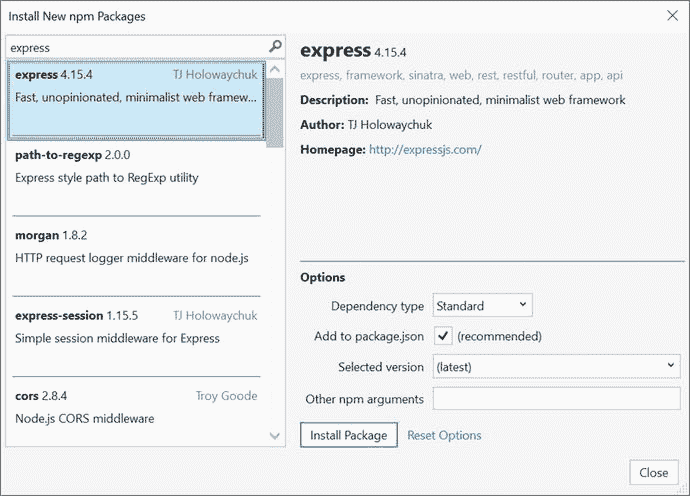
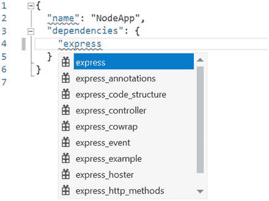

# 7.在服务器上运行 TypeScript

如果你觉得 Node 通过一次只运行一段代码来实现并行很奇怪，那是因为它确实如此。这是我称之为落后主义的一个例子。—吉姆·r·威尔逊

在服务器上运行 JavaScript 并不是一个新概念——Netscape Enterprise Server 早在 1994 年就提供了这个特性。目前有大量 JavaScript 的服务器端实现运行在超过六种不同的脚本引擎上。除了这些纯 JavaScript 实现之外，JavaScript 还可以在任何拥有脚本主机的平台上运行。

尽管 JavaScript 语言对于所有这些实现都是通用的，但每一种实现都将提供不同的 API、框架、模块或基本类库来执行基于浏览器的 JavaScript 程序中通常不可用的操作。服务器端实现中可用模块的范围至关重要，这就是 Node 如此成功的原因(也是它被选入本章的原因)。

Node 不仅有超过 475，000 个可用的模块，从简单的助手到整个数据库服务器，还可以通过一个简单的命令将它们添加到您的程序中，这要归功于 Node Package Manager (NPM)。这意味着您可以简单地通过在命令窗口中键入`npm install MongoDB`来添加一个数据库模块，比如 MongoDB。Node 是跨平台的，提供 Windows、Mac OSX、Linux、Docker 和 SunOS 的安装程序。

为了演示如何在 TypeScript 中使用 Node，本章逐步将一个简单的应用程序发展成一个使用多个模块的应用程序。这演示了代码以及添加包和类型定义的过程。虽然示例显示了来自 Visual Studio 和 Windows 命令提示符的屏幕截图，但您可以轻松地将您所学到的一切转移到其他开发工具和操作系统，例如，OSX 或 WebStorm 上的 Sublime Text 2 和 terminal 以及 Linux 上的 Terminal。如果您希望在不同的机器上获得类似的体验，组合是多种多样的，几个集成开发环境是跨平台的(Visual Studio Code、Cloud9、Eclipse、Sublime Text 2、Vim 和 WebStorm 都运行在 Windows、OSX 和 Linux 上)。

## 安装节点

您可以从 NodeJS 网站下载适用于您所选平台的安装程序

[T2`https://nodejs.org/en/download/`](https://nodejs.org/en/download/)

## 创建新项目

示例程序将从一个完全空的项目开始。图 [7-1](#Fig1) 显示了示例项目和解决方案的开始状态，其中包含一个空的`server.ts`文件。

如果您使用的是 Visual Studio 2017，可以通过使用 TypeScript 语言创建一个新的空白 Node.js 应用程序来复制它。如果您正在使用不同的开发环境，您可以简单地启动一个新的项目或文件夹并添加一个空的`server.ts`文件。


图 7-1。

Empty TypeScript project

要对节点进行自动完成和类型检查，您需要一个描述标准节点 API 的类型定义。最快的方法是与 NPM 合作。

## 新公共管理理论

您可以使用 NPM 来处理生产和开发依赖性。生产依赖项是应用程序运行时必须存在的模块。开发依赖项包括工具和类型定义，它们只在编码时需要，在运行应用程序时不需要。

在添加包之前，您需要一个名为 package.json 的特殊文件，如清单 [7-1](#Par15) 所示。该文件描述了您的程序，包括它所拥有的所有依赖项。每当您添加生产或开发依赖项时，该文件都会更新。

```js
{
  "name": "NodeApp"
}
Listing 7-1.The empty package.json file

```

Note

这还不是一个有效的 package.json 文件，但是有效的版本将在本章的稍后部分显示。这个超级简洁的版本将使 NPM 的例子更容易理解。

一旦有了 package.json 文件，添加依赖项唯一需要知道的就是它的名称。对于下面所有的例子，我们都使用 Express，这是一个轻量级的节点 web 框架。

安装包的第一个机制是 Visual Studio 包搜索，通过右键单击解决方案资源管理器的“npm”分支可以找到它。package explorer UI 的左侧允许您搜索软件包，并且您可以使用右侧底部的表单安装选定的软件包。标准选项会将最新版本的包添加到项目中。



图 7-2。

Install ing NPM packages via Visual Studio

您可以通过运行清单 [7-2](#Par20) 中所示的命令来获得相同的结果。这恰好是 UI 发出的原始命令。NPM 和 NodeJS 都很容易从您喜欢的命令窗口中使用。

```js
npm install express --save
Listing 7-2.Installing NPM packages via a command

```

无论您使用 UI 还是直接键入命令，install 命令中的 save 标志都会导致 package.json 文件被更新以显示依赖关系，如清单 [7-3](#Par22) 所示。

```js
{
  "name": "NodeApp",
  "dependencies": {

    "express": "^4.15.4"

  }

}
Listing 7-3.
Updated package.json

```

这就引出了添加包的第三种方法，即直接更新 package.json 文件。如果您在 Visual Studio 中这样做，您将获得包名和版本号的自动完成；这在图 [7-3](#Fig3) 中有所展示。



图 7-3。

Installing NPM packages via package.json

对于类型定义，只有在开发时才需要依赖项，而在生产中不需要。您可以通过在 package explorer UI 中选择“development”依赖类型，或者在运行 install 命令时使用 save 标志的`--save-dev`变体，将一个包标记为开发依赖。当通过 package.json 文件添加开发依赖时，它应该进入单独的`devDependencies`字典。

```js
{
  "name": "NodeApp",
  "dependencies": {
    "express": "^4.15.4"
  },
  "devDependencies": {

    "@types/node": "^8.0.26"

  }

}

Listing 7-4.Updated package.json with node type definition

```

现在你是一名 NPM 专家，你将能够添加创建一个工作节点 web 应用程序所需的任何依赖项，这是本章的主题。

## 简单节点程序

既然项目已经建立，就可以使用一个运行 web 服务器并响应请求的简单程序来演示 Node 了。HTTP 服务器只是将所有请求传递给您提供的回调函数。没有内置的工具来处理不同的请求或路由，或者帮助格式化响应(如果您需要这些，它们在中间件中是可用的，比如 Express，这将在本章后面介绍)。

清单 [7-5](#Par30) 显示了完整的程序，它创建了一个监听端口 8080 的 http 服务器。所有请求都被传递给`requestListener`函数，该函数对所有请求给出标准的文本响应。`requestListener`函数被传递给代表`request`和`response`的两个参数。可以从`request`参数中获得信息，比如方法、请求头和请求体。您可以在`response`参数的头和体中添加内容。你必须通过调用`response.end()`来表明你已经完成；否则，HTTP 服务器不向客户端发送响应，让客户端等待响应，直到超时。

引用注释用于指示节点类型定义的位置。这允许`import`语句引用`http`模块，该模块在项目中不作为外部模块出现——`http`模块将在运行时由 Node 提供。

```js
/// <reference path="./node_modules/@types/node/index.d.ts" />

import * as http from 'http';

const portNumber = 8080;

function requestListener(request: http.ServerRequest, response: http.ServerResponse) {
    response.writeHead(200, { 'Content-Type': 'text/plain' });
    response.write('Response Text Here');
    response.end();
}

http.createServer(requestListener).listen(portNumber);

console.log('Listening on localhost:' + portNumber);

Listing 7-5.A simple Node server

```

如果您将这个示例代码放在一个名为 app.ts 的文件中，那么您可以通过从包含源代码的文件夹中运行命令`node app.js`来运行这个清单中的 http 服务器(注意，您在这个命令中传递的是编译后的 JavaScript 文件，而不是 TypeScript 文件)。如图 [7-4](#Fig4) 所示，你会在命令窗口中看到消息`Listening on localhost:8080`。只要命令窗口保持打开，服务器就会运行。


图 7-4。

Running the program

要向服务器发出请求，请打开 web 浏览器并在地址栏中输入`localhost:8080`。您应该会收到如图 [7-5](#Fig5) 所示的`Response Text Here`消息。因为所有对服务器的请求都被发送到同一个`requestListener`方法，所以您可以在`localhost:8080`输入任何地址并接收相同的消息，例如`localhost:8080/Some/Path/Here/`或`localhost:8080/?some=query&string=here`。


图 7-5。

Calling the program from a browser

## 请求信息

能够如此容易地启动 web 服务器是很棒的，但是几乎可以肯定的是，您将希望从请求中获得信息，以提供与所请求的信息相匹配的响应。清单 [7-6](#Par34) 展示了如何获取请求方法和关于所请求 URL 的信息，这些信息可用于路由请求或获取用于查找与请求匹配的数据的数据。

```js
/// <reference path="./node_modules/@types/node/index.d.ts" />

import * as http from 'http';

const portNumber = 8080;

function requestListener(request: http.ServerRequest, response: http.ServerResponse) {
    response.writeHead(200, { 'Content-Type': 'text/plain' });
    response.write('Method: ' + request.method + '\n');
    response.write('Url: ' + request.url + '\n');
    response.write('Response Text Here');
    response.end();
}

http.createServer(requestListener).listen(portNumber);

console.log('Listening on localhost:' + portNumber);

Listing 7-6.Getting more information from the request

```

在本例中，从请求中获得的信息被简单地附加到响应中，以便在发出请求时在浏览器中显示这些信息。在地址栏输入`http://localhost:8080/Customers/Smith/John`后，响应如图 [7-6](#Fig6) 所示。您可以使用请求的属性来决定如何处理请求。


图 7-6。

Displaying information about the request

虽然您可以使用这些信息编写自己的框架来处理对节点服务器的请求，但是路由请求和从请求中获取信息的工作已经很好地完成了，并且可以作为一个模块与 NPM 一起安装。除非您想使用请求信息做一些不寻常的事情，否则您可能会发现，使用一个为您的程序提供框架的现有模块将会节省时间和精力，并涵盖您没有计划的场景。

下一节描述如何使用 Express 模块构建应用程序，Express 模块是一个轻量级的 web 框架，用于 Node，它不指定授权、持久性或模板的细节。

## 使用 Express 编写应用程序

在 Node 中处理原始请求和响应允许访问 HTTP 通信的底层细节；但大多数情况下，你不会有兴趣自己处理所有的细节。Express 模块提供了一个轻量级框架，允许您将精力集中在应用程序上，而不是路由和 HTTP 通信上。Express 既是一种快速入门的方式，也是一个将您的程序整合在一起的健壮框架。

要使用 Express，您需要 Express 依赖项和 Express 类型定义开发依赖项。应用程序的 package.json 文件的更完整版本如清单 [7-7](#Par40) 所示，其中包括这两个依赖项。

```js
{
  "name": "node-app",
  "version": "0.0.1",
  "description": "NodeApp",
  "main": "server.js",
  "author": {
    "name": "Steve Fenton"
  },
  "dependencies": {
    "express": "4.15.4"

  },
  "devDependencies": {
    "@types/node": "8.0.26",

    "@types/express": "4.0.37"

  }
}
Listing 7-7.Example package.json

```

package.json 文件指出，我们程序的入口点将是名为 server.js 的文件，它包含 express 依赖项，以及来自@types 组织的节点和 Express 类型定义。

### 简单快速程序

清单 [7-8](#Par44) 是基于 Express 的简单节点程序的更新版本，而不是基于`http`模块。虽然一般的模式是相似的，但是`requestListener`是专门添加到应用程序根地址的 HTTP GET 方法中的。

这意味着只有对`http://localhost:8080/`的请求才会调用`requestListener`函数。与前面的例子不同，不匹配路由的请求将会失败，例如，对`http://localhost:8080/` `Customers`的请求将会收到带有消息“`Cannot GET /Customers/Smith/John`”的 404 响应。

```js
import * as express from 'express';

const portNumber = 8080;
const app = express();

app.get('/', (request, response) => {
    response.send('You requested ' + request.query.firstname + ' ' + request.query.lastname);
})

app.listen(portNumber, 'localhost', () => {
    console.log('Listening on localhost:' + portNumber);
});

Listing 7-8.Using Express

```

这个例子的正确请求应该包括`firstName`和`lastName`查询字符串参数。Express 将查询字符串映射到`request.query`属性。`http://localhost:8080/?firstname=John&lastname=Smith`的完整示例请求地址将导致响应中返回消息`You requested John Smith`，如图 [7-7](#Fig7) 所示。


图 7-7。

Calling the Ex press program

### 多条路线

您可以在您的程序中为不同的路线提供不同的处理程序，例如，清单 [7-9](#Par47) 中的代码为`http://localhost:8080/` `One/`和`http://localhost:8080/Two/`分别提供了一个处理程序。Express 为您处理所有路由，并确保正确的功能处理每个请求。

```js
import * as express from 'express';

const portNumber = 8080;
const app = express();

app.get('/', (request, response) => {
    response.send('You requested ' + request.query.firstname + ' ' + request.query.lastname);
})

app.get('/One/', (request, response) => {

    response.send('You got handler One');

});

app.get('/Two/', (request, response) => {

    response.send('You got handler Two');

});

app.listen(portNumber, 'localhost', () => {
    console.log('Listening on localhost:' + portNumber);
});

Listing 7-9.Using multiple routes

```

您可以像以前一样在浏览器中测试这些路由，并获得适当的响应

*   `http://localhost:8080/` `One/` - >“你得到了一号处理者”
*   `http://localhost:8080/Two/` - >“你有二号处理员”

对尚未注册的路由器 e 的请求将导致 404 not found 响应。

### 处理错误

通过向`app.use`方法提供一个接受四个参数的函数，可以为应用程序提供一个通用的错误处理程序。在清单 [7-10](#Par53) 中，`handler`函数被修改为抛出一个故意的错误。使用`app.use`方法设置错误处理程序，并在返回 500 响应代码之前将错误记录到控制台。

```js
import * as express from 'express';

const portNumber = 8080;
const app = express();

app.get('/', (request, response) => {
    throw new Error('Deliberate Error!');
})

app.listen(portNumber, 'localhost', () => {
    console.log('Listening on localhost:' + portNumber);
});

app.use(function (error, request, response, next) {
    console.error(error.message);
    response.status(500).send('An error has occurred.');
});

Listing 7-10.General error handler

```

当您向该版本的应用程序发出请求时，完整的错误堆栈将显示在命令窗口中，但 web 浏览器将显示一般错误消息，如图 [7-8](#Fig8) 所示。这允许您在不公开披露任何内容的情况下，使用完整的错误信息执行日志记录操作。


图 7-8。

General error in the browser

本例中的错误处理程序是 Express 中中间件的一个很好的演示，Express 是一组组织成一个责任链的功能。每个中间件都可以处理请求和响应，允许您分离横切关注点。在实践中，这意味着您可以避免使用负责日志记录、授权和错误处理的处理程序，而是为每项职责提供单独的中间件。

您可以通过调用 app.use 来添加中间件，其中 app 是您的 Express 应用程序的名称。您传递的用作中间件的函数必须遵循以下两个签名之一:

*   请求处理程序`(request: Request, response: Response, next: NextFunction) => void`；
*   错误请求处理程序:`(error: any, request: Request, response: Response, next: NextFunction) => void;`

每个中间件被依次调用，并且必须要么使用`next()`函数调用下一个中间件，要么结束响应。如果没有中间件结束响应，结果是 404 错误。

### 快递图书项目

现在我们已经介绍了 Node 和 Express 的基本概念，我们将使用一个小的示例应用程序来将它们放在一起。为了跟进，你需要安装一些免费软件和一些 NPM 软件包。该应用程序将包含多条路线，收集用户输入的数据，并将信息存储在数据库中。

*   来自 [`www.mongodb.com/download-center`](http://www.mongodb.com/download-center) 的 MongoDB 社区服务器；
*   清单 [7-11](#Par64) 中所示的 NPM 包。

为了创建这个应用程序，您将使用来自 NPM 的一些额外的包，这将使事情变得更快更容易。安装清单 [7-11](#Par64) 中列出 package.json 文件的依赖项。额外的包帮助解析发送回服务器的表单，与 MongoDB 数据库对话，并解析我们的视图，这些视图是使用 Pug——一种简单的 HTML 模板语言——编写的。

```js
{
  "name": "pro-typescript-book-app",
  "version": "0.0.1",
  "description": "An example book application",
  "main": "server.js",
  "types": "server.d.ts",
  "author": {
    "name": "Steve.Fenton"
  },
  "dependencies": {
    "body-parser": "1.17.2",
    "express": "4.15.4",
    "method-override": "2.3.9",
    "mongoose": "4.11.9",
    "pug": "2.0.0-rc.3"
  },
  "devDependencies": {
    "@types/body-parser": "1.16.5",
    "@types/express": "4.0.37",
    "@types/method-override": "0.0.30",
    "@types/mongoose": "4.7.21",
    "@types/node": "8.0.26",
    "@types/pug": "2.0.4"
  }
}

Listing 7-11.Additional dependencies

```

应用程序的主要入口点将是服务器文件，如清单 [7-12](#Par66) 所示。这个文件包含运行整个应用程序所需的所有依赖项，并且有一个单一的根来捕获对主页的请求。视图引擎也被设置为使用 Pug，模板位于“views”文件夹中。

```js
import * as express from 'express';
import * as http from 'http';
import * as path from 'path';
import * as bodyParser from 'body-parser';
import * as methodOverride from 'method-override';
import * as routes from './routes/index';

const portNumber = 8080;
const app = express();

app.set('port', portNumber);

// Configure view templates

app.set('views', path.join(__dirname, 'views'));

app.set('view engine', 'pug');

http.createServer(app).listen(app.get('port'), () => {
    console.log('Express server listening on port ' + app.get('port'));
});

app.use(bodyParser.json());
app.use(bodyParser.urlencoded({ extended: true }));
app.use(methodOverride());

// routes

app.get('/', routes.index);

// static files, such as .css files
app.use(express.static('.'));

Listing 7-12.
Server.ts

```

代码被放在一个模块中，该模块位于一个包含所有路由处理程序的文件夹中，而不是直接将处理主页的函数放在服务器文件中。随着应用程序的增长，以这种方式组织代码将使每个文件保持较小且易于维护。主页路由处理程序的内容如清单 [7-13](#Par68) 所示，它有一个单独的导出函数，用一个小数据模型呈现响应。

```js
import * as express from 'express';

/* GET home page. */
export function index(request: express.Request, response: express.Response) {
    response.render('index', { title: 'Express' });
};

Listing 7-13./routes/index.ts

```

因为我们已经将 Pug 设置为我们的视图引擎，所以我们需要提供一个模板文件用于主页。当我们调用`response.render`时，文件名应该与清单 [7-13](#Par68) 中使用的名称相匹配。主页的 Pug 视图如清单 [7-14](#Par70) 所示。该模板扩展了共享布局，可用于为所有页面或页面组提供一致的 HTML 布局。主页模板在共享布局的“内容”区域插入标题、段落和锚定标记。

```js
extends layout

block content
  h1= title
  p Welcome to #{title}
  a(href='/book') Books

Listing 7-14.Pug template for the home page

```

共享布局模板如清单 [7-15](#Par72) 所示，它是一个简单的 HTML 文档，带有标题和样式表，以及可以由子模板填充的内容块。

```js
doctype html
html
  head
    title= title
    link(rel='stylesheet', href='/style.css')
  body
    block content

Listing 7-15.Shared layout for Pug templates

```

一个简单样式表的 CSS 如清单 [7-16](#Par74) 所示。这可以放在名为 style.css 的根文件夹中的一个文件中。因为我们使用`app.use(express.static('.'));`设置 Express 服务器来处理静态文件，所以对样式表的请求将由静态文件中间件来处理。如果没有这个中间件，对样式表的请求将导致 404 错误，即使文件确实存在于服务器上。

```js
body {
        padding: 50px;
        font: 14px "Lucida Grande", Helvetica, Arial, sans-serif;
}

a {
        color: #00B7FF;
}

Listing 7-16.Style Sheet

```

您可以使用清单 [7-17](#Par76) 中所示的命令运行 Express 服务器。当服务器运行时，您可以通过导航到`localhost:8080`在浏览器中查看。

```js
node server.js
Listing 7-17.Run the Express server

```

您应该看到如图 [7-9](#Fig9) 所示的输出，这意味着路由、路由处理器、视图模板和样式表都成功加载。如果您单击 books 链接，您将收到一条错误消息，因为该路线还没有处理程序。


图 7-9。

Home Page

到目前为止，示例演示了如何将路由处理程序分离到一个单独的模块中，如何为视图使用 Pug 模板，以及如何通过中间件启用静态文件。接下来，我们将研究连接到数据库来存储和检索数据。

#### 添加图书路线

为了管理图书列表，应用程序需要支持一个`/book`路径。为了支持典型的路由，您需要添加一个路由处理程序模块、一个 Pug 模板，并在您的 Express 应用程序中引用路由处理程序。

清单 [7-18](#Par81) 显示了`book.ts`文件的起点，它将处理对`/book`地址的请求。像所有请求处理程序一样，list 函数有`request`和`response`参数。处理程序对结果调用`response.render`方法，传入视图名称和表示要显示的数据的模型对象。

```js
import * as express from 'express';
declare var next: (error: any) => void;

/* GET /book */
export function list(request: express.Request, response: express.Response) {
    response.render('book', { 'title': 'Books', 'books': [] });
};

Listing 7-18.The routes/book.ts file

```

要使该处理程序工作，views 文件夹中必须有一个具有指定名称的视图。清单 [7-19](#Par83) 显示了`book.pug`模板，它将呈现请求处理器提供的数据。该模板重用了`layout.pug`文件，这是应用程序的默认布局，并从模型对象中呈现`title`。

```js
extends layout

block content
  h1= title
  p Welcome to the #{title} page.
  p #{message}

Listing 7-19.The views/book.pug file

```

要在您的应用程序中注册这个路由，您需要修改`server.ts`文件，以添加引用`book.ts`文件的导入语句，并添加路由注册。清单 [7-20](#Par85) 显示了将`/book`地址链接到包含请求处理程序的`book.ts`文件所需的另外两行。

```js
import * as book from './routes/book';

// ...

// routes
app.get('/', routes.index);

app.get('/book', book.list);

Listing 7-20.The additions to the server.ts file

```

当您运行您的应用程序并在 web 浏览器中访问`/book`地址时，您应该看到一个显示消息“欢迎来到图书页面”的页面如果没有进入新页面，请检查命令窗口以查看任何错误。最常见的错误是拼写错误，例如，不小心输入了`'book` `s` `'`作为视图名称，而它应该是`'book'`。

#### 收集数据

存储数据的第一步是提供一个允许用户输入信息的表单。清单 [7-21](#Par89) 展示了更新后的`book.pug`模板，它现在有一个接受书名和作者以及可选 ISBN 标识符的表单。

HTML 属性通过将它们附加在元素名称的括号中来添加到元素中。每个输入的`type`和`name`属性以这种方式添加。清单中值得注意的属性是 ISBN 输入中的`pattern`属性。ISBN 不是必需的，但是如果提供了它，它必须与该属性中提供的模式相匹配。

```js
extends layout

block content
  h1= title
  p Welcome to the #{title} page.
  p #{message}
  form(method='post')
    fieldset
        legend Add a Book
        div
            label Title *
                br
                input(type='text', name='book_title', required)
        div
            label Author *
                br
                input(type='text', name='author', required)
        div
            label ISBN
                br
                input(type='text', name='book_isbn', pattern='(?:(?=.{17}$)97[89][ -](?:[0-9]+[ -]){2}[0-9]+[ -][0-9]|97[89][0-9]{10}|(?=.{13}$)(?:[0-9]+[ -]){2}[0-9]+[ -][0-9Xx]|[0-9]{9}[0-9Xx])')
        div
            button Save

Listing 7-21.Adding a form to the Pug view

```

如果您担心必须编写像上面这样接受各种 ISBN 格式的模式，不要担心，因为这个模式和许多其他模式可以在位于 [`http://html5pattern.com/`](http://html5pattern.com/) 的 HTML5 模式库中找到。向 input 元素添加模式属性时，将验证输入的文本是否与表达式匹配。

为了在提交表单时对其进行处理，必须将处理表单 post 的函数添加到`routes`目录中的`book.ts`文件中。清单 [7-22](#Par92) 显示了带有`submit`功能的更新文件。在这个阶段，该函数只是向视图提供一条消息，确认没有保存任何内容，因为还没有数据库。数据库将在下一节中添加。

```js
import * as express from 'express';
declare var next: (error: any) => void;

/* GET /book */
export function list(request: express.Request, response: express.Response) {
    response.render('book', { 'title': 'Books', 'books': [] });
};

/* POST /book */
export function submit(request: express.Request, response: express.Response) {
    const newBook = new Book({
        title: request.body.book_title,
        author: request.body.author,
        isbn: request.body.book_isbn
    });

    response.render('book', { title: 'Books', 'books': [newBook] });
}

Listing 7-22.Adding a handler to the book.ts file

```

要将表单 post 发送到 submi t 函数，必须在`app.ts`文件中注册路线。清单 [7-23](#Par94) 显示了更新的路由，其中有新的 post 路由，它将转发由`book.submit`函数处理的匹配请求。

```js
// routes
app.get('/', routes.index);
app.get('/book', book.list);

app.post('/book', book.submit);

Listing 7-23.The updated routes in the app.ts file

```

如果您编译并运行更新后的应用程序并访问`/book`地址，您应该会看到允许添加书籍的表单。只有在提供了标题和作者的情况下，您才能提交表单。如果您在可选的 ISBN 输入中输入任何值，它必须是有效的格式，例如 10 位数字的`0-932633-42-0`或 13 位数字的`9780932633422`。


图 7-10。

Book Page

当您成功提交表单时，结果尚未保存在数据库中。开发这个应用程序的下一步是持久化数据，以便以后可以可靠地检索它。

#### 安装猫鼬

在节点应用程序中存储数据有许多选项。您可以使用文件系统、关系数据库(如 MySQL)或 NOSQL 数据库(如 MongoDB)。在这个例子中，MongoDB 将被 Mongoose 包装，为应用程序提供数据访问。Mongoose 可以简化验证、查询和类型转换等操作。

在执行本节中的代码之前，您需要设置您的数据库。要为您的平台下载 MongoDB，请访问 [`https://www.mongodb.com/download-center`](https://www.mongodb.com/download-center) 。下载是一个简单的安装程序，适用于您选择的平台。

MongoDB 将您的数据存储在文件系统上，因此您需要设置一个文件夹用于存储。默认情况下，MongoDB 会查找一个`c:\data\db`目录，因此您应该在继续之前添加这个目录。如果不添加这个文件夹，当您尝试启动 MongoDB 服务器时，它会立即停止。如果愿意，您可以将数据放在不同的目录中。在启动数据库服务器时，您还需要提供 MongoDB 的路径。现在，只需添加默认目录。

要启动 MongoDB 数据库服务器，请在命令窗口中运行清单 [7-24](#Par101) 中所示的代码。这个命令是为 MongoDB 3.4 版编写的，所以如果您有不同的版本，您将需要更改路径。

```js
C:\Program Files\MongoDB\Server\3.4\bin\mongod.exe
Listing 7-24.Running the database server

```

您应该会收到一条消息，说明服务器“正在等待[端口号]上的连接”。当您从应用程序连接到数据库时，将需要此消息中显示的号码(通常为 27017)。如果出现任何错误，请仔细检查是否已经设置了`c:\data\db`目录。

Mongoose 模块和类型定义应该已经可用了，因为它是在本章前面添加到`package.json`中的。现在，您应该已经准备好开始保存数据所需的一切。下一节将演示对 Express Book 项目的更改，以存储和检索用户输入的图书。

#### 存储数据

为了存储用户提交新书时收到的数据，必须更改`routes`目录中的`book.ts`文件，以调用新安装的数据库。

清单 [7-25](#Par106) 显示了更新后的处理程序、`list`处理程序显示数据库中的书籍，而`submit`处理程序保存新的提交。连接数据库的代码在函数之外，在函数之间共享。下面显示了所有更改的更详细的演练。

```js
import * as express from 'express';
import * as mongoose from 'mongoose';
declare var next: (error: any) => void;

// MongoDB typically runs on port 27017

mongoose.connect('mongodb://localhost:27017/books', { useMongoClient: true });

// Defines a book

interface Book extends mongoose.Document {
    title: string;
    author: string;
    isbn: string;
}

// Defines the book database schema

const bookSchema = new mongoose.Schema({
    title: String, author: String, isbn: String
});

const Book = mongoose.model<Book>('Book', bookSchema);

/* GET /book */
export function list(request: express.Request, response: express.Response) {
    Book.find({})

        .then((res) => {
            response.render('book', { 'title': 'Books', 'books': res });
        })
        .catch((err) => {
            return next(err);
        });
};

/* POST /book */
export function submit(request: express.Request, response: express.Response) {
    const newBook = new Book({
        title: request.body.book_title,
        author: request.body.author,
        isbn: request.body.book_isbn
    });

    newBook.save()

        .then((res) => {
            response.redirect('/book');
        })
        .catch((err) => {
            return next(err);
        });
}

Listing 7-25.The updated routes/book.ts file

```

使用`mongoose.connect`调用建立数据库连接。示例中的连接字符串使用端口 27017；您应该使用启动`MongoDB`服务器时显示的端口号。当你的应用程序连接到数据库时，每个连接都会被记录到`MongoDB`命令窗口。

给变量`bookSchema`分配一个新的 Mongoose 模式。该模式定义了要存储在集合中的文档的形状。Mongoose 为您设置了 MongoDB 集合，并可以处理默认值和验证。使用`title`、`author,`和`ISBN`属性设置图书的模式，这些属性都被分配了类型`String`。模式的定义与 TypeScript 类型注释惊人地相似。由于语句的上下文，TypeScript 编译器足够聪明，能够意识到它们不是类型批注；因此，它不使用类型擦除将它们从编译后的输出中删除。问题中的`String`类型不是支持 TypeScript 中的`string`类型注释的`String`接口，而是一个`mongoose.Schema.Types.String`。如果你不小心使用了小写的`string`类型，编译器会对你的错误给出警告。

变量`Book`被赋予一个 Mongoose 创建的模型对象。这让您不必自己编写一个`Book`类的实现。您可以使用这个模型在任何需要的时候创建书籍的新实例，就像您编写自己的类一样。

虽然这需要几段文字来解释，但还是有必要重温一下代码清单，以确认可以连接到数据库，并在三行代码中为图书数据设置模式。这种设置用于处理请求的两个函数。

`list`函数调用 Mongoose 提供的`Book.find`方法来检索记录。您可以向用于过滤结果的`find`方法提供一个对象。该对象可以是图书模式的部分匹配。例如，您可以使用`{ author: 'Robert C. Martin' }`来检索 Bob 叔叔的所有书籍。在本例中，空对象表示您想要集合中的所有文档。

因为查询是异步执行的，所以依赖于结果的代码放在适当的`then`块中。如果您忘记将代码放在`then`块中，响应将在查询完成之前发送。使用`catch`模块处理错误。`books`集合被添加到传递给视图的模型对象中。

Note

尽管该示例使用一个空对象来查询集合并检索所有书籍，但是随着越来越多的书籍添加到数据库中，该查询会变得越来越慢。您可以使用 skip 和 limit 查询方法对结果进行分页。

`submit`函数用用户提交的数据实例化一个新的`Book`对象，然后调用 Mongoose 提供的`save`方法。同样，数据库调用是异步的，一旦查询得到解决，承诺就会继续。在代码清单中，当记录保存成功时，响应只是重定向到`list`动作。提交后重定向请求可以防止用户通过刷新浏览器意外地重新提交相同的数据。成功提交后重定向的模式称为 Post Redirect Get 模式。

现在，路由处理程序正在将图书数据传递给视图，可以更新视图以显示数据。添加表格的附加标记如清单 [7-26](#Par116) 所示。

```js
    table
        thead
            tr
                th Title
                th Author
                th ISBN
        tbody
            if books

                each book in books

                    tr
                        td= book.title
                        td= book.author
                        td= book.isbn
Listing 7-26.The Pug table template

```

Pug 模板中的`each`循环重复了`books`集合中每一项的嵌套输出。表格单元格使用简写语法声明(元素名后跟一个`=`)。这意味着数据变量不需要像标题一样包含在通常的`#{}`分隔符中。

Pug 的`each`循环将处理一个空数组，而不是一个未定义的值。示例中`each`循环之前的`if`语句防止未定义的值到达`each`循环。

现在，您拥有了一个可以保存和显示书籍的全功能应用程序。您可以在表单中输入一本书，如图 [7-11](#Fig11) 所示。


图 7-11。

Completed Book Form

当您点击保存按钮时，您的图书将被保存，您将看到图 [7-12](#Fig12) 中的页面。您可以随时返回到您的应用程序，存储的图书仍然可用。


图 7-12。

Stored Book

存储在 MongoDB 中的数据是持久的，这意味着您可以重新启动机器，数据仍然会被存储。这为您提供了一个永久的存储，除非机器完全崩溃，在这种情况下，您可能需要为您的数据考虑一个合适的备份策略。您可以在 [`https://docs.mongodb.com/manual/core/backups/`](https://docs.mongodb.com/manual/core/backups/) `.`了解更多关于 MongoDB 备份方法的信息

## 摘要

JavaScript 对于 web 服务器来说并不陌生，并且已经获得了巨大的吸引力，这要归功于 Node 和通过 Node Package Manager 提供的数以千计的模块。随着编写更大的程序在 Node 上运行，TypeScript 提供的语言特性和工具的价值迅速增加。大量的时间可能会浪费在简单的错误上，比如将依赖于异步调用的代码放在回调函数之外，或者在打算使用`String`时使用`string`，而 TypeScript 可以帮助您避免这些常见的错误。

Express framework 是一种快速入门的方式，它将为使用过 Sinatra(或 Nancy in)的程序员提供一些熟悉感。网)。即使对于那些不熟悉这种实现风格的人来说，路由处理器和视图的分离也是显而易见的。与在 Node 中处理低级别的 HTTP 请求和响应相比，使用 Express 将提高您的生产率。

Mongoose 为数据库扮演了类似的角色，提供了许多快捷方式来提高您的工作效率。如果您想降低一个级别，通过直接调用 MongoDB 来存储和检索数据，自己处理模型和验证，MongoDB 并不特别棘手。

尽管本章很高兴地保留了 Express 附带的许多默认设置，但您并不局限于使用这些默认设置。用一行代码替换模板引擎和中间件是微不足道的。

## 要点

*   JavaScript 已经在 web 服务器上运行了 20 多年。
*   Node 可以在任何平台上愉快地运行。
*   您可以从 NPM 的@types 组织获得节点和许多节点模块的类型信息。
*   Express 提供了一个轻量级的、灵活的应用程序框架，比低级别的节点 HTTP 请求和响应更容易使用。
*   Mongoose 和 MongoDB 通过异步 API 提供简单的持久性。